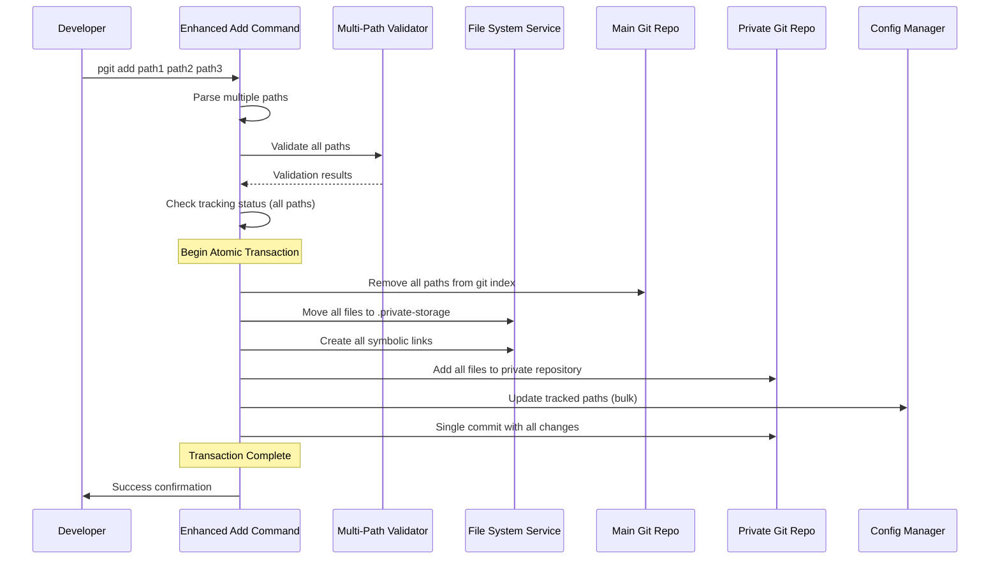
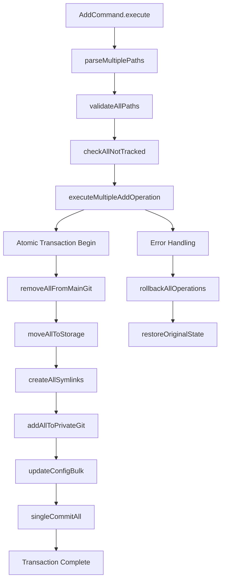
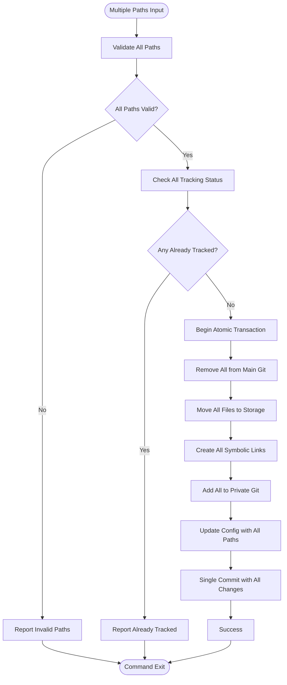

# Multiple File Tracking Feature Design

## Overview

This design document outlines the enhancement to the `pgit add` command to support simultaneous tracking of multiple files and directories. The feature enables users to add multiple paths in a single operation while maintaining the existing atomic transaction guarantees and creating only one commit in the private storage repository.

**Current State**: The `pgit add <path>` command currently accepts only a single file or directory path.

**Target State**: The `pgit add` command will accept multiple paths and process them as a single atomic transaction, resulting in one commit containing all added files.

## Technology Stack & Dependencies

The feature leverages the existing technology stack:
- **TypeScript**: For type safety and enhanced development experience
- **Commander.js**: CLI framework for argument parsing and command definition
- **Simple-git**: Git operations library that already supports multiple file operations
- **fs-extra**: Enhanced file system operations with atomic capabilities
- **Chalk**: Terminal output styling
- **Zod**: Schema validation for input validation

## Command Interface Enhancement

### Current Command Signature
```bash
pgit add <path>
```

### Enhanced Command Signature  
```bash
pgit add <path...>
# Examples:
pgit add file1.env file2.config
pgit add src/config/ .env database.yml
pgit add "file with spaces.conf" folder1/ folder2/
```

### Command Arguments
- **path...** (required): One or more file or directory paths to add to private tracking
- **-v, --verbose** (optional): Show detailed output of each operation step
- **-f, --force** (optional): Force operation even if some paths have issues (future enhancement)

## Architecture Enhancement

### Component Interaction



### Enhanced Add Command Architecture



## Implementation Details

### Multi-Path Processing Strategy

#### 1. Path Validation and Normalization
```typescript
interface MultiPathValidationResult {
  validPaths: string[];
  invalidPaths: Array<{ path: string; error: string }>;
  normalizedPaths: string[];
  alreadyTracked: string[];
}

private async validateAndNormalizeMultiplePaths(
  filePaths: string[]
): Promise<MultiPathValidationResult>
```

#### 2. Atomic Transaction Management
The multiple file operation maintains atomicity by:
- **Phase 1**: Validation of all paths before any modifications
- **Phase 2**: Atomic execution of all operations
- **Phase 3**: Single commit containing all changes
- **Rollback**: Complete restoration if any step fails

#### 3. Batch Processing Operations



### Error Handling Strategy

#### Validation Phase Errors
- **Invalid paths**: Report all invalid paths before proceeding
- **Permission issues**: Check permissions for all paths upfront
- **Already tracked**: Identify and report all already-tracked paths

#### Transaction Phase Errors
- **Atomic rollback**: If any operation fails, rollback all previous operations
- **Partial success handling**: No partial success - either all files are added or none
- **State restoration**: Restore original git states for all affected paths

### Git Integration

#### Single Commit Strategy
```typescript
private async commitAllToPrivateGit(
  relativePaths: string[], 
  baseMessage: string
): Promise<void> {
  const privateStoragePath = path.join(this.workingDir, DEFAULT_PATHS.storage);
  const gitService = new GitService(privateStoragePath, this.fileSystem);
  
  // Add all files in batch
  await gitService.addFiles(relativePaths);
  
  // Single commit with comprehensive message
  const commitMessage = this.generateMultiFileCommitMessage(relativePaths, baseMessage);
  await gitService.commit(commitMessage);
}
```

#### Commit Message Format
```
Add multiple files to private tracking

Files added:
- config/database.yml
- .env.local
- src/secrets/api-keys.json

Total: 3 files, 2 directories affected
```

## Data Flow Architecture

### Input Processing Flow
1. **Command Parsing**: Commander.js parses variadic arguments
2. **Path Collection**: Gather all provided paths into array
3. **Path Normalization**: Convert relative/absolute paths to normalized relative paths
4. **Duplicate Detection**: Remove duplicate paths after normalization

### Transaction Flow
1. **Pre-validation**: All paths validated before any file operations
2. **Git State Capture**: Record original git state for all paths
3. **Batch Operations**: Execute all file operations in sequence
4. **Configuration Update**: Single bulk update to tracked paths
5. **Git Commit**: Single commit with all changes

### Rollback Flow
1. **Error Detection**: Any failure triggers complete rollback
2. **Reverse Operations**: Execute rollback actions in reverse order
3. **State Restoration**: Restore original git states and file locations
4. **Cleanup**: Remove any partially created artifacts

## Configuration Management

### Bulk Configuration Updates
```typescript
// Enhanced ConfigManager method
public async addMultipleTrackedPaths(relativePaths: string[]): Promise<void> {
  const config = await this.load();
  
  // Add all paths in single operation
  const newPaths = relativePaths.filter(path => 
    !config.trackedPaths.includes(path)
  );
  
  config.trackedPaths.push(...newPaths);
  config.lastModified = new Date().toISOString();
  
  await this.save(config);
}
```

### Configuration Schema Enhancement
```typescript
interface TrackedPathEntry {
  path: string;
  addedAt: string;
  batchId?: string; // Group files added together
}

interface PrivateConfig {
  version: string;
  trackedPaths: string[]; // Backward compatibility
  trackedEntries: TrackedPathEntry[]; // Enhanced tracking
  lastModified: string;
  statistics: {
    totalFiles: number;
    totalDirectories: number;
    lastBatchSize: number;
  };
}
```

## Performance Considerations

### Batch Operation Optimizations
- **Parallel Validation**: Validate multiple paths concurrently where safe
- **Efficient Git Operations**: Leverage GitService.addFiles() for batch git operations
- **Minimal I/O**: Reduce file system calls through batch operations
- **Memory Management**: Process large file sets in chunks if needed

### Scalability Limits
- **Path Limit**: Reasonable limit on number of simultaneous paths (e.g., 100)
- **Command Line Length**: Consider OS command line length limitations
- **Memory Usage**: Monitor memory usage for large file operations

## Testing Strategy

### Unit Testing Requirements
```typescript
describe('Multiple File Add Operations', () => {
  test('should add multiple files successfully');
  test('should handle mixed files and directories');
  test('should validate all paths before processing');
  test('should create single commit for all files');
  test('should rollback completely on any failure');
  test('should handle duplicate paths gracefully');
  test('should respect path limits');
});
```

### Integration Testing Scenarios
- **Large File Sets**: Test with 50+ files
- **Mixed Path Types**: Files, directories, symlinks
- **Error Conditions**: Invalid paths, permission issues, git conflicts
- **Cross-Platform**: Windows, macOS, Linux compatibility
- **Edge Cases**: Empty directories, special characters, long paths

### Performance Testing
- **Benchmark**: Compare single vs multiple file operations
- **Memory Usage**: Monitor memory consumption patterns
- **Git Performance**: Measure git operation times with large batches