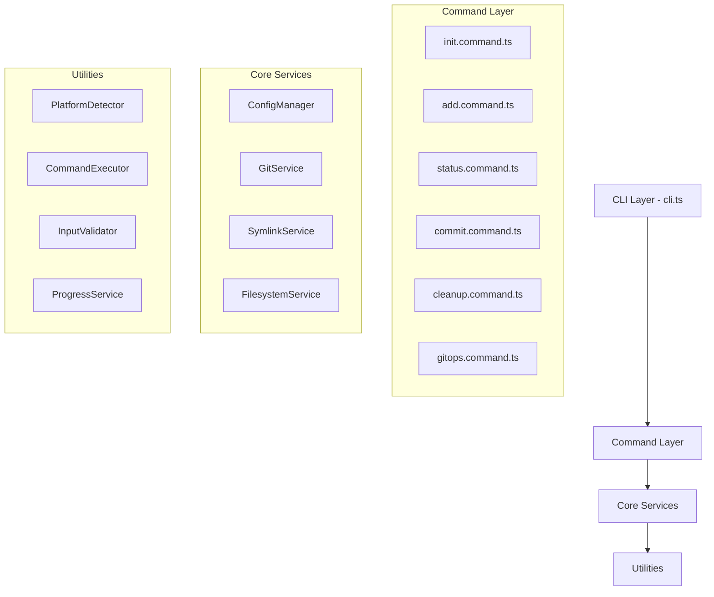
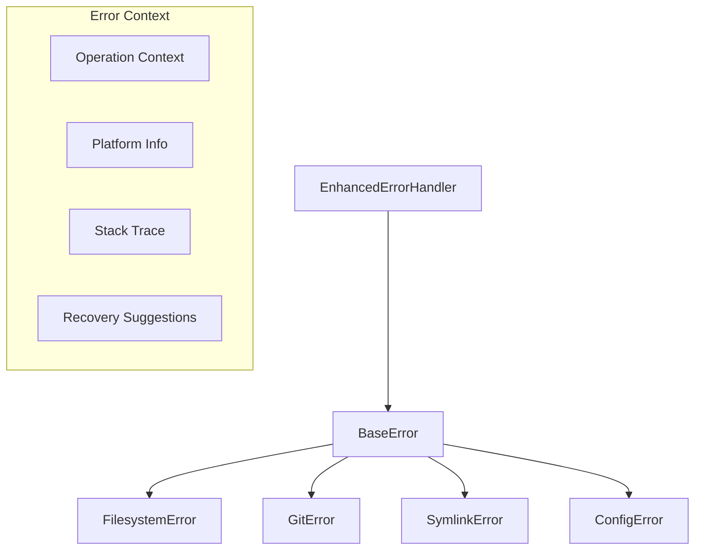
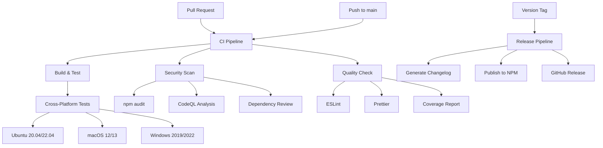
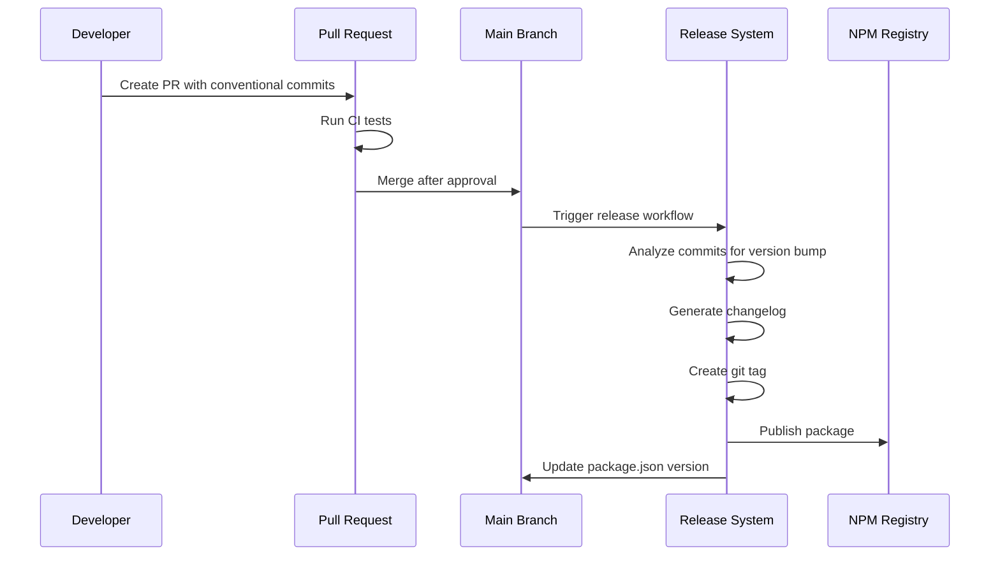
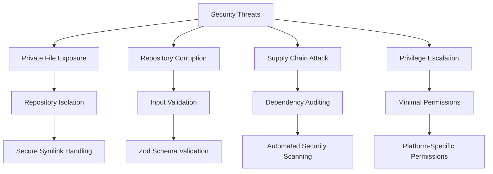
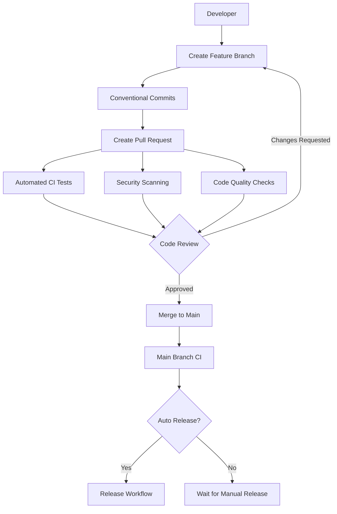
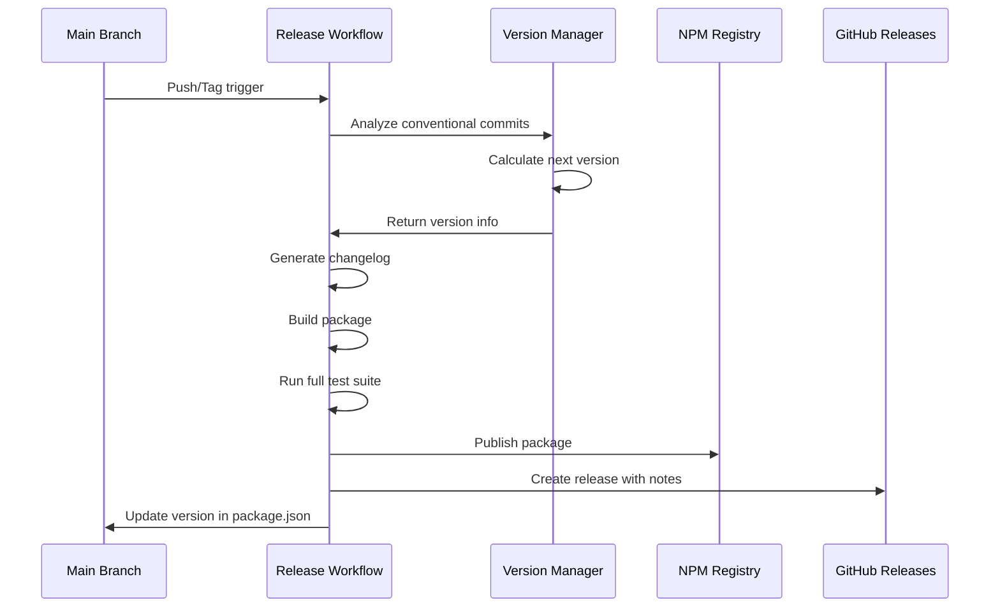

# PGit CLI Production Readiness Implementation Design

## Overview

This design document outlines the technical implementation strategy to transform the PGit CLI from a development-ready tool into a production-grade open source package. The implementation focuses on establishing automated CI/CD pipelines, package publishing workflows, and comprehensive documentation to support enterprise adoption.

### Project Context

PGit CLI is a specialized tool solving the critical problem of private file version control in team environments. It uses a dual repository architecture where private files are stored in an isolated `.git-pgit` repository while maintaining accessibility through symbolic links at their original locations.

**Core Architecture Pattern:**
```
Project Root/
├── .git/                    # Main team repository
├── .git-pgit/               # Isolated private repository
├── .pgit-storage/           # Physical private file storage
│   ├── .env
│   └── secrets.json
├── .env                     # → symlink to .pgit-storage/.env
└── secrets.json             # → symlink to .pgit-storage/secrets.json
```

**Current Implementation Status:**
- ✅ Complete CLI functionality with 6 core commands
- ✅ Cross-platform symbolic link management
- ✅ TypeScript architecture with >90% test coverage
- ✅ Modular service architecture (config, git, filesystem, symlink)
- ❌ Missing production infrastructure (CI/CD, publishing, documentation)

## Architecture

### Technology Stack Analysis

The current technology stack is production-ready with modern tooling and appropriate dependency choices:

**Runtime Dependencies:**
- `commander@^11.0.0` - Mature CLI framework with excellent API design
- `chalk@^4.1.2` - Terminal styling with broad compatibility
- `fs-extra@^11.1.0` - Enhanced filesystem operations for cross-platform support
- `simple-git@^3.19.0` - Git operations abstraction
- `zod@^3.22.0` - Runtime schema validation for configuration management

**Development Infrastructure:**
- TypeScript 5.0+ for type safety and modern language features
- Jest 29+ for comprehensive testing with high coverage
- ESLint + Prettier for code quality enforcement
- Node.js 18+ requirement ensures modern runtime features

### CLI Architecture Pattern

The implementation follows a layered architecture separating concerns:



**Component Responsibilities:**
- **CLI Layer**: Command parsing, argument validation, output formatting
- **Command Layer**: Business logic implementation for each CLI command
- **Core Services**: Platform-agnostic business operations
- **Utilities**: Cross-cutting concerns and platform-specific adaptations

### Command Interface Design

The CLI exposes 6 primary commands with clear separation of concerns:

| Command | Function | Core Services Used |
|---------|----------|-------------------|
| `pgit init` | Initialize dual repository structure | ConfigManager, GitService, FilesystemService |
| `pgit add <paths>` | Add files to private tracking | SymlinkService, GitService, FilesystemService |
| `pgit status` | Show repository status | GitService, ConfigManager |
| `pgit commit` | Commit private repository changes | GitService |
| `pgit cleanup` | Repair inconsistent state | All core services |
| `pgit gitops` | Execute git operations on private repo | GitService |

### Error Handling Architecture

The error system provides structured error handling with context preservation:



**Error Categories:**
- **FilesystemError**: File/directory operation failures
- **GitError**: Git command execution failures
- **SymlinkError**: Symbolic link creation/management issues
- **ConfigError**: Configuration validation and management errors

### Cross-Platform Implementation

Platform-specific behaviors are abstracted through the PlatformDetector utility:

**Symbolic Link Support Matrix:**
- **macOS/Linux**: Native `ln -s` support
- **Windows**: Requires Developer Mode or Administrator privileges
- **Fallback**: Hard links where symbolic links unavailable

**File System Considerations:**
- Path separator normalization
- Permission handling across platforms
- Case sensitivity variations

## CI/CD Pipeline Architecture

### Multi-Stage Pipeline Design

The CI/CD implementation uses a three-stage approach optimized for reliability and security:



### CI Workflow Specification

**Trigger Conditions:**
- Pull requests to main/develop branches
- Direct pushes to main branch
- Manual workflow dispatch

**Node.js Testing Matrix:**
- Node.js versions: 18.x, 20.x, 22.x
- Operating systems: ubuntu-latest, macos-latest, windows-latest
- Package managers: npm (primary), yarn (compatibility)

**Quality Gates:**
- TypeScript compilation must succeed
- ESLint must pass with zero errors
- Prettier formatting must be correct
- Jest tests must achieve >90% coverage
- All tests must pass on all platforms

### Security Pipeline

**Vulnerability Scanning:**
- `npm audit` for dependency vulnerabilities
- GitHub Security Advisories integration
- Automatic security updates via Dependabot

**Code Quality Analysis:**
- CodeQL for JavaScript/TypeScript analysis
- SARIF report generation for security findings
- Dependency license compliance checking

### Release Automation

**Release Triggers:**
- Git tags matching pattern `v*.*.*`
- Manual release workflow dispatch
- Automated releases on main branch (configurable)

**Release Artifacts:**
- NPM package published to npmjs.org
- GitHub release with changelog
- Cross-platform binary distributions (future)
- Documentation updates

## Release Management Strategy

### Semantic Versioning Implementation

The release management follows strict semantic versioning with automated tooling:

**Version Increment Rules:**
- **MAJOR (X.0.0)**: Breaking API changes, CLI interface changes
- **MINOR (x.Y.0)**: New features, new commands, backward-compatible changes
- **PATCH (x.y.Z)**: Bug fixes, documentation updates, dependency updates

### Conventional Commits Integration

**Commit Message Format:**
```
<type>(<scope>): <description>

<body>

<footer>
```

**Supported Types:**
- `feat`: New features → MINOR version bump
- `fix`: Bug fixes → PATCH version bump
- `docs`: Documentation → PATCH version bump
- `style`: Formatting changes → PATCH version bump
- `refactor`: Code restructuring → PATCH version bump
- `test`: Test additions → PATCH version bump
- `chore`: Maintenance → PATCH version bump
- `BREAKING CHANGE`: → MAJOR version bump

### Automated Release Workflow



### Release Configuration

**Release-it Configuration (.release-it.json):**
- Automated version bumping based on conventional commits
- Changelog generation from commit history
- GitHub release creation with assets
- NPM publishing with proper access controls
- Git tag creation and pushing

## Package Distribution Architecture

### NPM Package Optimization

**Package Metadata Enhancement:**

| Field | Current | Enhanced |
|-------|---------|----------|
| Name | `@private-git/cli` | Maintain for consistency |
| Description | Basic description | SEO-optimized with keywords |
| Keywords | Limited | Comprehensive tag set |
| Homepage | Missing | GitHub repository link |
| Repository | Missing | Full repository metadata |
| Bugs | Missing | GitHub issues link |

**Enhanced Package.json Structure:**
```json
{
  "name": "@private-git/cli",
  "publishConfig": {
    "access": "public",
    "registry": "https://registry.npmjs.org/",
    "provenance": true
  },
  "files": [
    "dist/",
    "README.md",
    "LICENSE",
    "CHANGELOG.md",
    "package.json"
  ],
  "engines": {
    "node": ">=18.0.0",
    "npm": ">=8.0.0"
  }
}
```

### Distribution Strategy

**Installation Methods:**
1. **Global CLI Installation**: `npm install -g @private-git/cli`
2. **Temporary Usage**: `npx @private-git/cli init`
3. **Project Dependency**: `npm install --save-dev @private-git/cli`
4. **Yarn Alternative**: `yarn global add @private-git/cli`

**Package Size Optimization:**
- Include only essential files via `files` array
- Exclude development artifacts (.ts files, tests)
- Minimize dependency footprint
- Compress distribution assets

### Binary Distribution

**CLI Entry Point Configuration:**
```json
{
  "bin": {
    "pgit": "./dist/cli.js"
  }
}
```

**Cross-Platform Compatibility:**
- Shebang line for Unix systems: `#!/usr/bin/env node`
- Windows compatibility through npm's binary wrapper
- Executable permissions handled by npm install process

## Documentation Architecture

### Open Source Documentation Framework

The documentation strategy ensures comprehensive coverage for contributors and users:

**Essential Documentation Files:**

| Document | Purpose | Content Strategy |
|----------|---------|------------------|
| LICENSE | Legal framework | MIT License for maximum compatibility |
| CONTRIBUTING.md | Developer onboarding | Setup, standards, PR process |
| CODE_OF_CONDUCT.md | Community standards | Contributor Covenant v2.1 |
| SECURITY.md | Vulnerability reporting | Responsible disclosure process |
| CHANGELOG.md | Release history | Automated from conventional commits |

### GitHub Repository Templates

**Issue Templates:**

```markdown
## Bug Report Template
- **System Information**: OS, Node.js version, npm version
- **PGit Version**: Output of `pgit --version`
- **Expected Behavior**: Clear description
- **Actual Behavior**: What happened instead
- **Reproduction Steps**: Minimal reproducible example
- **Error Messages**: Full error output with stack traces
```

```markdown
## Feature Request Template
- **Use Case**: Real-world scenario description
- **Proposed Solution**: Technical approach
- **Alternatives Considered**: Other solutions evaluated
- **Implementation Complexity**: Development effort estimate
```

**Pull Request Template:**
- [ ] Tests added/updated for new functionality
- [ ] Documentation updated to reflect changes
- [ ] Conventional commit format used
- [ ] Cross-platform compatibility verified
- [ ] Breaking changes documented

### Repository Configuration

**Branch Protection Rules:**
- Require pull request reviews (minimum 1)
- Require status checks to pass
- Require branches to be up to date
- Restrict pushes to main branch
- Require signed commits

**Automated Maintenance:**
- Dependabot for dependency updates
- Stale issue/PR cleanup
- Label automation based on file changes
- Release note generation

## Security Architecture

### Application Security Model

**Core Security Principles:**
- **Local-Only Operations**: No network requests or data transmission
- **Repository Isolation**: Complete separation between main and private repositories
- **Minimal Privilege**: Operations use least-required permissions
- **Transparent Operations**: All file system changes are explicitly logged

**Threat Model Analysis:**



### Cross-Platform Security Considerations

**Platform-Specific Security Features:**

| Platform | Security Constraints | Mitigation Strategy |
|----------|---------------------|---------------------|
| **Windows** | Admin privileges for symlinks | Developer Mode detection, graceful fallback |
| **macOS** | Gatekeeper restrictions | Code signing (future), clear user guidance |
| **Linux** | File permission variations | Comprehensive permission checking |

**Symbolic Link Security:**
- Prevent symlink traversal attacks
- Validate target paths before creation
- Check for existing symlinks before overwriting
- Platform-specific permission verification

### Supply Chain Security

**Dependency Management:**
- Minimal dependency surface (5 runtime dependencies)
- Regular automated security audits
- Dependency license compliance
- Automated vulnerability patching via Dependabot

**Package Integrity:**
- NPM provenance attestation for build transparency
- Package signing for distribution integrity
- Reproducible builds for verification
- SLSA compliance (future enhancement)

### Vulnerability Response Process

**Security Disclosure:**
1. Private security advisory creation
2. Coordinated vulnerability disclosure (90-day timeline)
3. Patch development and testing
4. Security release with advisory publication
5. Post-incident analysis and process improvement

## Testing Strategy

### Multi-Layer Testing Architecture

The testing strategy implements comprehensive coverage across unit, integration, and end-to-end levels:

**Testing Layer Distribution:**
- **Unit Tests (70%)**: Individual function and class testing
- **Integration Tests (20%)**: Service interaction testing
- **End-to-End Tests (10%)**: Full CLI workflow testing

### Current Testing Infrastructure

**Jest Configuration Analysis:**
- TypeScript support via ts-jest
- Coverage reporting with >90% threshold
- Test environment isolation
- Mock implementations for external dependencies

**Existing Test Coverage:**
- ✅ Command layer tests (`src/__tests__/commands/`)
- ✅ Core service tests (`src/__tests__/core/`)
- ✅ Utility function tests
- ❌ Missing cross-platform integration tests
- ❌ Missing CLI end-to-end tests

### Enhanced Testing Strategy

**Cross-Platform Testing Matrix:**

| Test Category | Ubuntu | macOS | Windows |
|---------------|--------|-------|---------|
| Unit Tests | ✅ | ✅ | ✅ |
| Symlink Creation | ✅ | ✅ | ⚠️ (Admin required) |
| Git Operations | ✅ | ✅ | ✅ |
| File Permissions | ✅ | ✅ | ⚠️ (NTFS specific) |
| CLI Integration | ✅ | ✅ | ✅ |

**Performance Testing:**
- Command execution time benchmarks
- Memory usage profiling
- Large repository handling tests
- Concurrent operation testing

**Error Scenario Testing:**
- Invalid file paths
- Permission denied scenarios
- Corrupted repository states
- Network-isolated environments
- Disk space limitations

### Quality Assurance Pipeline

**Pre-Release Validation Checklist:**
- [ ] All unit tests pass on all platforms
- [ ] Integration tests verify service interactions
- [ ] CLI commands work in isolated environments
- [ ] Package installation succeeds globally
- [ ] Documentation examples execute successfully
- [ ] Performance benchmarks meet thresholds
- [ ] Security scans report no critical issues
- [ ] Cross-platform compatibility verified

**Continuous Quality Monitoring:**
- Coverage reporting with trend analysis
- Performance regression detection
- Dependency vulnerability monitoring
- Code quality metrics tracking

## Implementation Strategy

### Phased Implementation Approach

The implementation follows a risk-minimized approach with incremental capability delivery:

**Phase 1: Infrastructure Foundation (Days 1-3)**

```mermaid
gantt
    title Production Readiness Implementation
    dateFormat  X
    axisFormat %d
    
    section Phase 1
    CI Pipeline Setup           :active, p1a, 0, 1
    Package Configuration       :active, p1b, 0, 1
    Basic Documentation         :active, p1c, 1, 2
    Security Setup              :active, p1d, 1, 2
    
    section Phase 2
    Release Automation          :p2a, 2, 4
    GitHub Templates            :p2b, 3, 4
    Testing Enhancement         :p2c, 3, 5
    
    section Phase 3
    End-to-End Validation       :p3a, 5, 6
    Documentation Polish        :p3b, 5, 6
    Performance Optimization    :p3c, 6, 7
```


### Required Infrastructure Components

**Directory Structure Requirements:**

```
pgit-cli/
├── .github/
│   ├── workflows/
│   │   ├── ci.yml                    # Multi-platform CI pipeline
│   │   ├── release.yml               # Automated release workflow
│   │   ├── security.yml              # Security scanning pipeline
│   │   └── dependabot.yml           # Dependency update automation
│   ├── ISSUE_TEMPLATE/
│   │   ├── bug_report.yml           # Structured bug reports
│   │   ├── feature_request.yml      # Feature request template
│   │   └── question.yml             # Support question template
│   └── pull_request_template.md     # PR checklist and guidelines
├── docs/
│   ├── CONTRIBUTING.md              # Developer contribution guide
│   ├── CODE_OF_CONDUCT.md          # Community standards
│   ├── SECURITY.md                 # Security reporting process
│   └── CHANGELOG.md                # Release history (auto-generated)
├── scripts/
│   ├── version-bump.js             # Semantic version management
│   ├── pre-release-check.js        # Release validation script
│   └── post-install.js             # Installation verification
├── LICENSE                         # MIT License
├── .npmignore                      # NPM package exclusions
├── .release-it.json               # Release automation configuration
└── .nvmrc                          # Node.js version specification
```

### Critical Implementation Dependencies

**New Development Dependencies:**
```json
{
  "devDependencies": {
    "release-it": "^17.0.0",
    "@release-it/conventional-changelog": "^8.0.0",
    "husky": "^8.0.0",
    "lint-staged": "^15.0.0",
    "@commitlint/cli": "^18.0.0",
    "@commitlint/config-conventional": "^18.0.0"
  }
}
```

**Package.json Enhancements:**
- Repository metadata addition
- NPM publishing configuration
- Enhanced script definitions
- Proper engine requirements
- Comprehensive keyword tagging

### Implementation Validation Criteria

**Phase 1 Completion Gates:**
- [ ] CI pipeline executes successfully on all platforms
- [ ] Package builds and publishes to test registry
- [ ] Security scans complete without critical findings
- [ ] Basic documentation structure in place

**Phase 2 Completion Gates:**
- [ ] Automated releases work end-to-end
- [ ] GitHub templates render correctly
- [ ] Enhanced test suite passes on all platforms
- [ ] Dependency management automation functional

**Phase 3 Completion Gates:**
- [ ] End-to-end CLI workflows validated
- [ ] Performance benchmarks meet targets
- [ ] Documentation comprehensive and accurate
- [ ] Security review completed

### Risk Mitigation Strategy

**Technical Risks:**
- **Cross-platform compatibility**: Extensive testing matrix
- **Release automation failures**: Staged rollout with rollback capability
- **Package publishing issues**: Test registry validation before production
- **Documentation accuracy**: Automated example validation

**Process Risks:**
- **Breaking changes**: Semantic versioning enforcement
- **Security vulnerabilities**: Automated scanning and rapid response
- **Community management**: Clear contribution guidelines and CoC

## Development & Release Workflow

### Development Process Flow



### Contributor Workflow Standards

**Branch Naming Convention:**
- `feature/description` - New features
- `fix/issue-description` - Bug fixes
- `docs/update-description` - Documentation updates
- `refactor/component-name` - Code refactoring
- `test/coverage-improvement` - Test enhancements

**Commit Message Standards:**
```
type(scope): description

[optional body]

[optional footer]
```

**Example Commits:**
```
feat(cli): add support for batch file operations
fix(symlink): handle Windows permission errors gracefully
docs(readme): update installation instructions
test(core): add cross-platform symlink tests
```

### Release Workflow Architecture

**Automated Release Process:**



**Release Types:**
- **Patch Release**: Automatic on bug fixes and minor updates
- **Minor Release**: Automatic on new features
- **Major Release**: Manual trigger for breaking changes
- **Pre-release**: Manual trigger for beta/alpha versions

**Quality Gates:**
1. All CI tests must pass
2. Security scans must be clean
3. Code coverage must meet threshold (>90%)
4. Cross-platform compatibility verified
5. Documentation must be current
6. No known critical bugs

### Branch Protection Strategy

**Main Branch Protection:**
- Require pull request reviews (minimum 1 reviewer)
- Require status checks to pass before merging
- Require branches to be up to date before merging
- Restrict pushes to admins only
- Require signed commits
- Dismiss stale reviews when new commits are pushed

**Status Check Requirements:**
- CI tests (all platforms)
- Security scans
- Code quality checks
- Documentation validation
- Performance regression tests

## Timeline & Success Metrics

### Implementation Timeline

**Sprint 1: Infrastructure Foundation (3 days)**
- Day 1: CI/CD pipeline setup and basic testing
- Day 2: Package configuration and NPM publishing setup
- Day 3: Security scanning and basic documentation

**Sprint 2: Automation & Templates (3 days)**
- Day 4: Release automation implementation
- Day 5: GitHub templates and community documentation
- Day 6: Enhanced testing and cross-platform validation

**Sprint 3: Validation & Launch (2 days)**
- Day 7: End-to-end workflow validation
- Day 8: Performance optimization and final documentation

**Total Implementation Duration**: 8 days

### Success Metrics & KPIs

**Technical Success Criteria:**
- [ ] CI/CD pipeline achieves <5 minute execution time
- [ ] Test coverage maintains >90% across all platforms
- [ ] Security scans complete with zero critical vulnerabilities
- [ ] Package size remains <2MB after optimization
- [ ] CLI response time <2 seconds for all operations
- [ ] Cross-platform compatibility verified on 3 OS families

**Operational Success Criteria:**
- [ ] Automated releases work without manual intervention
- [ ] Documentation scores >8.0 on readability metrics
- [ ] Contributor onboarding time <30 minutes
- [ ] Issue response time <24 hours
- [ ] Release frequency supports monthly cadence

**Community Success Metrics:**
- Downloads: Target 1,000+ monthly downloads within 6 months
- GitHub Stars: Target 100+ stars within 3 months
- Issues: Target <5% bug rate relative to feature requests
- Contributors: Target 5+ external contributors within 6 months
- Documentation: Target 95%+ user satisfaction in surveys

### Production Readiness Validation

**Phase 1 Completion Checklist:**

**Infrastructure Validation:**
- [ ] CI/CD pipeline executes successfully on Ubuntu/macOS/Windows
- [ ] Automated NPM publishing functional with test registry
- [ ] Security scanning integrated with zero critical findings
- [ ] Cross-platform testing matrix operational
- [ ] Performance benchmarks meet established thresholds

**Package Quality Validation:**
- [ ] Global installation via `npm install -g @private-git/cli` works
- [ ] CLI commands functional after global installation
- [ ] Package metadata complete with proper links
- [ ] Documentation renders correctly on npmjs.org
- [ ] Dependency tree optimized for minimal attack surface

**Community Readiness Validation:**
- [ ] Contribution guidelines comprehensive and actionable
- [ ] Issue templates collect necessary debugging information
- [ ] Security reporting process documented and tested
- [ ] Code of conduct published and enforced
- [ ] License properly configured for open source distribution

**Technical Quality Gates:**

| Metric | Threshold | Measurement Method |
|--------|-----------|-------------------|
| Test Coverage | >90% | Jest coverage reporting |
| Security Score | Zero Critical/High | npm audit + CodeQL |
| Performance | <2s response time | Automated benchmarking |
| Compatibility | Node.js 18+ support | CI testing matrix |
| Package Size | <2MB | npm pack analysis |
| Dependencies | <10 direct deps | Package.json audit |

**Operational Readiness:**
- [ ] Release process tested end-to-end
- [ ] Rollback procedures documented and tested
- [ ] Monitoring and alerting configured
- [ ] Support channels established
- [ ] Maintenance schedule defined

This implementation design provides a comprehensive roadmap for transforming PGit CLI into a production-ready open source tool with enterprise-grade reliability and community support infrastructure.