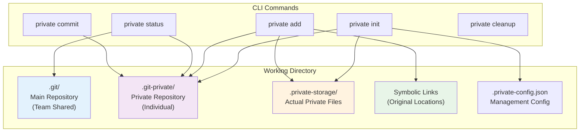
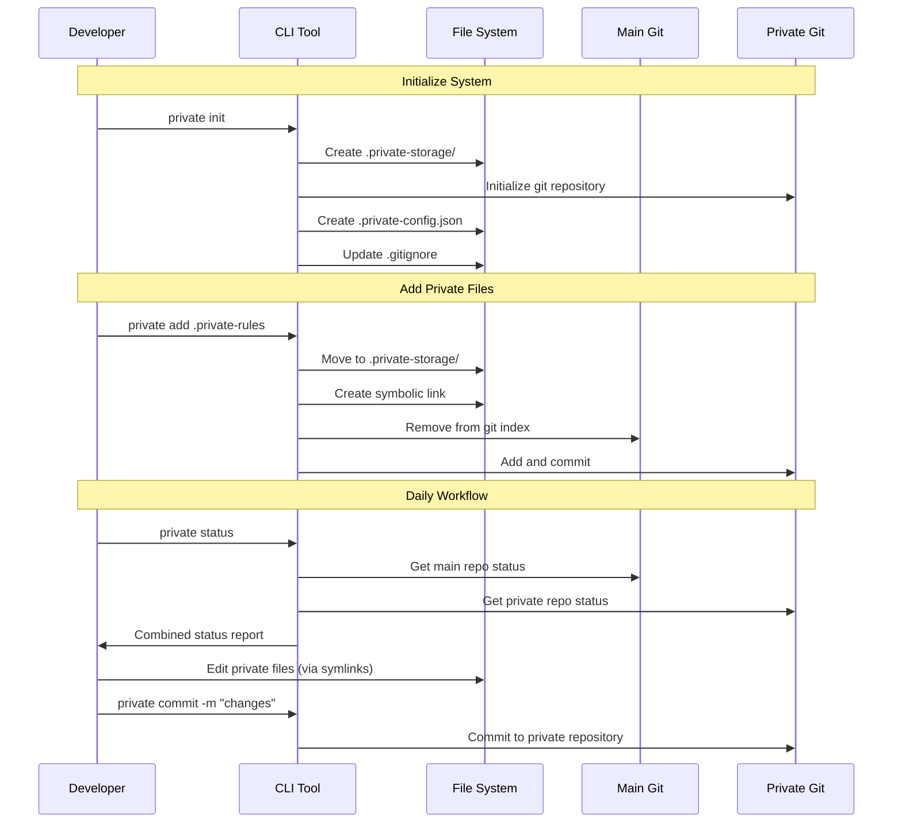
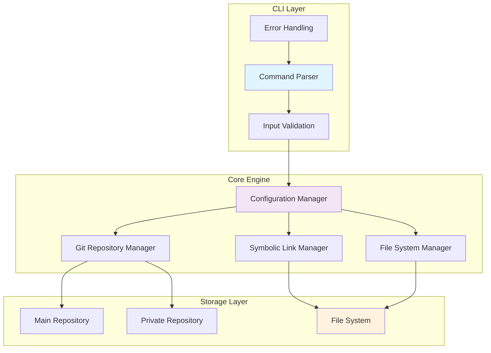

# Private Git Tracking CLI 

## Table of Contents
1. [Problem Statement](#problem-statement)
2. [Solution Overview](#solution-overview)
3. [Success Criteria](#success-criteria)
4. [System Architecture](#system-architecture)
5. [CLI Tool Specification](#cli-tool-specification)
6. [Implementation Guidelines](#implementation-guidelines)
7. [Deployment & Distribution](#deployment--distribution)
8. [Testing Strategy](#testing-strategy)
9. [Security Considerations](#security-considerations)
10. [Future Enhancements](#future-enhancements)

---

## Problem Statement

### Core Challenge
Developers need to version control specific files and directories that must remain **excluded from the main team repository** while:
- Keeping files in their **exact original locations** for application compatibility
- Having **zero impact** on team members' workflow
- Avoiding **shared configuration changes** (no .gitignore modifications for team)
- Maintaining **complete local control** over private file management

### Key Constraints
- **File Location Preservation**: Files must stay in exact original paths
- **Team Isolation**: Zero configuration shared with team
- **Application Compatibility**: Agent/tool dependencies must continue working
- **Version Control**: Full git history for private files
- **Safety**: No risk of accidentally committing private files to main repo
- **Cross-Platform**: Must work on macOS, Linux, and Windows

### Real-World Scenarios
- **Private configuration files** containing sensitive credentials
- **Developer-specific settings** and preferences
- **Local tooling dependencies** not meant for team sharing
- **Personal automation scripts** and workflows
- **Environment-specific configurations**

---

## Solution Overview

### Dual Repository System with Symbolic Links

The solution implements a **dual repository architecture** where:

1. **Main Repository** (`.git/`) - Team shared, unaffected
2. **Private Repository** (`.git-private/`) - Individual developer, isolated
3. **Symbolic Links** - Files appear in original locations but stored privately
4. **CLI Management** - Simple commands to manage the dual system



### Core Technology Stack
- **Runtime**: Node.js (v18+)
- **CLI Framework**: Commander.js
- **File Operations**: fs-extra
- **Output Styling**: Chalk v4.1.2
- **Package Manager**: npm
- **Version Control**: Git (required)

---

## Success Criteria

### ✅ Functional Requirements Met

| Requirement | Implementation | Verification |
|-------------|----------------|--------------|
| **File Location Preservation** | Symbolic links maintain original paths | Applications access files normally |
| **Team Isolation** | .gitignore excludes all private components | `git status` shows no private files |
| **Version Control** | Full git repository for private files | `private status` shows commit history |
| **Safety** | Automatic git index cleanup | Cannot accidentally commit private files |
| **Cross-Platform** | OS detection + platform-specific commands | Works on macOS, Linux, Windows |

### ✅ Operational Success

| Metric | Target | Achievement |
|--------|--------|-------------|
| **Status Visibility** | Independent repo status checking | ✅ `private status` + `private-status` commands |
| **Command Response** | < 2 seconds execution time | ✅ All commands execute quickly |
| **Error Handling** | Graceful failure with clear messages | ✅ Comprehensive error handling |
| **Workflow Integration** | Seamless developer experience | ✅ No disruption to existing git workflow |

### ✅ Technical Validation

- **Repository Isolation**: Two independent git repositories
- **Symbolic Link Integrity**: Files accessible at original locations
- **Configuration Management**: JSON-based tracking and settings
- **Git Index Safety**: Automatic cleanup prevents main repo pollution
- **Cross-Platform Compatibility**: Handles Windows junctions and Unix symlinks

---

## System Architecture

### Directory Structure

```
project-root/
├── .git/                          # Main repository (existing, unchanged)
├── .git-private/                  # Private repository (created by CLI)
├── .private-storage/              # Actual private files storage
│   ├── .git/                     # Private git repository
│   ├── .private-rules/           # Moved private directory
│   ├── .private-rules-2/         # Another private directory
│   └── README.md                 # Initial private repo file
├── .private-config.json          # CLI configuration
├── .gitignore                    # Updated with private exclusions
├── .private-rules@               # Symbolic link -> .private-storage/.private-rules
├── .private-rules-2@             # Symbolic link -> .private-storage/.private-rules-2
├── bin/                          # CLI tool executable
│   └── private.js               # Main CLI implementation
├── package.json                  # Node.js dependencies
└── src/                          # Regular project files (unchanged)
```

### Data Flow Architecture



### Component Interaction Model



---

## CLI Tool Specification

### Command Interface

#### Core Commands

| Command | Purpose | Options | Example |
|---------|---------|---------|---------|
| `private init` | Initialize dual repository system | None | `private init` |
| `private add <path>` | Add file/directory to private tracking | Path (required) | `private add .env` |
| `private status` | Show both main and private repo status | None | `private status` |
| `private-status` | Show detailed private repo status only | `--verbose`, `-v` | `private-status -v` |
| `private commit` | Commit changes to private repository | `-m <message>` | `private commit -m "update"` |
| `private cleanup` | Fix git status issues with private files | None | `private cleanup` |

#### Command Details

##### 1. Initialize Command
```bash
private init
```

**Functionality:**
- Creates `.git-private/` directory with bare git repository
- Creates `.private-storage/` directory with working git repository
- Generates `.private-config.json` configuration file
- Updates `.gitignore` to exclude private system files
- Creates initial commit in private repository

**Exit Codes:**
- `0` - Success
- `1` - Already initialized
- `2` - Git not available
- `3` - Permission denied

##### 2. Add Command
```bash
private add <path>
```

**Functionality:**
- Validates path exists and is not already tracked
- Removes path from main git index (if tracked)
- Moves files/directories to `.private-storage/`
- Creates symbolic link at original location
- Commits addition to private repository
- Updates configuration with tracked path

**Validation:**
- Path must exist
- Path must not be already tracked
- Must have write permissions
- Cannot be system files (`.git`, etc.)

##### 3. Status Commands
```bash
private status          # Both repositories
private-status          # Private repository only
private-status --verbose # Detailed private information
```

**Status Output Includes:**
- Current branch information
- Working directory status
- Commit history summary
- Symbolic link health check
- Tracked paths verification

##### 4. Commit Command
```bash
private commit -m "commit message"
```

**Functionality:**
- Checks for changes in private repository
- Stages all changes in `.private-storage/`
- Creates commit with provided message
- Leaves main repository unaffected

##### 5. Cleanup Command
```bash
private cleanup
```

**Functionality:**
- Removes orphaned git index entries
- Repairs broken symbolic links
- Updates `.gitignore` if needed
- Validates configuration integrity

### Configuration Schema

```json
{
  "version": "1.0.0",
  "privateRepoPath": ".git-private",
  "storagePath": ".private-storage",
  "trackedPaths": [
    ".private-rules",
    ".private-rules-2",
    ".env.local"
  ],
  "initialized": "2024-08-27T12:51:43.006Z",
  "lastCleanup": "2024-08-27T13:15:20.123Z",
  "settings": {
    "autoGitignore": true,
    "autoCleanup": true,
    "verboseOutput": false
  }
}
```

### Error Handling Strategy

#### Error Categories

1. **Initialization Errors**
   - Already initialized
   - Git not available
   - Permission denied
   - Invalid directory

2. **File Operation Errors**
   - Path not found
   - Permission denied
   - Symbolic link creation failed
   - File move failed

3. **Git Operation Errors**
   - Repository corruption
   - Commit failed
   - Index corruption
   - Remote operation failed

4. **Configuration Errors**
   - Invalid JSON format
   - Missing configuration
   - Version mismatch
   - Corrupted settings

#### Error Response Format

```javascript
{
  "error": true,
  "code": "SYMLINK_FAILED",
  "message": "Failed to create symbolic link",
  "details": "Permission denied for target location",
  "suggestion": "Run with appropriate permissions or check file ownership",
  "recoverable": true
}
```

---

## Implementation Guidelines

### Development Setup

#### Prerequisites
```json
{
  "node": ">=18.0.0",
  "npm": ">=8.0.0",
  "git": ">=2.25.0",
  "os": ["darwin", "linux", "win32"]
}
```

#### Project Structure
```
private-git-cli/
├── bin/
│   └── private.js              # Main executable
├── lib/
│   ├── commands/              # Command implementations
│   │   ├── init.js
│   │   ├── add.js
│   │   ├── status.js
│   │   ├── commit.js
│   │   └── cleanup.js
│   ├── core/                  # Core functionality
│   │   ├── config.js          # Configuration management
│   │   ├── git.js             # Git operations
│   │   ├── symlink.js         # Symbolic link operations
│   │   └── filesystem.js      # File system operations
│   └── utils/                 # Utilities
│       ├── logger.js          # Logging utilities
│       ├── validator.js       # Input validation
│       └── platform.js        # Platform detection
├── test/                      # Test suite
├── docs/                      # Documentation
├── package.json
└── README.md
```

### Code Quality Standards

#### ESLint Configuration
```json
{
  "extends": ["eslint:recommended"],
  "env": {
    "node": true,
    "es2021": true
  },
  "rules": {
    "no-console": "off",
    "prefer-const": "error",
    "no-var": "error",
    "semi": ["error", "always"]
  }
}
```

#### Testing Requirements
- **Unit Test Coverage**: > 90%
- **Integration Tests**: All command workflows
- **Cross-Platform Tests**: macOS, Linux, Windows
- **Error Scenario Tests**: All error conditions

### Performance Requirements

| Operation | Max Time | Measurement |
|-----------|----------|-------------|
| `private init` | 2 seconds | Directory creation + git init |
| `private add` | 1 second per MB | File move + symlink creation |
| `private status` | 500ms | Git status + symlink check |
| `private commit` | 1 second | Git commit operation |

### Security Considerations

#### File System Security
- **Path Traversal Protection**: Validate all file paths
- **Permission Validation**: Check read/write permissions before operations
- **Symlink Safety**: Prevent symlink attacks and loops
- **Git Repository Isolation**: Ensure repositories cannot interfere

#### Configuration Security
- **Input Sanitization**: Validate all configuration inputs
- **File Permission**: Secure configuration file permissions (600)
- **Backup Strategy**: Automatic configuration backups
- **Recovery Mechanism**: Configuration corruption recovery

#### Git Security
- **Index Protection**: Prevent main repository pollution
- **Commit Isolation**: Ensure commits stay in correct repository
- **Branch Protection**: Prevent accidental branch operations
- **Remote Safety**: Handle remote repository operations safely

---

## Deployment & Distribution

### Package Distribution

#### NPM Package Structure
```json
{
  "name": "@private-git/cli",
  "version": "1.0.0",
  "description": "Private file tracking with dual git repositories",
  "bin": {
    "private": "./bin/private.js"
  },
  "engines": {
    "node": ">=18.0.0"
  },
  "keywords": ["git", "private", "version-control", "cli"]
}
```

#### Installation Methods

1. **Global NPM Installation**
```bash
npm install -g @private-git/cli
```

2. **Project-Specific Installation**
```bash
npm install --save-dev @private-git/cli
npx private init
```

3. **Binary Distribution**
- Standalone executables for each platform
- No Node.js dependency required
- Self-contained installation

### Platform-Specific Considerations

#### macOS
- **Symbolic Links**: Native support with `ln -s`
- **Permissions**: Handle macOS security policies
- **Installation**: Homebrew formula support

#### Linux
- **Symbolic Links**: Native support across distributions
- **Permissions**: Standard Unix permissions
- **Installation**: apt/yum package support

#### Windows
- **Symbolic Links**: Use `mklink /D` for directory junctions
- **Permissions**: Handle Windows ACL system
- **Installation**: Chocolatey package support

---

## Testing Strategy

### Test Categories

#### 1. Unit Tests
```javascript
// Example test structure
describe('Symbolic Link Manager', () => {
  test('creates symlink on Unix systems', async () => {
    const manager = new SymlinkManager();
    await manager.create('/source/path', '/target/path');
    expect(fs.lstatSync('/target/path').isSymbolicLink()).toBe(true);
  });
});
```

#### 2. Integration Tests
- **Full Workflow Tests**: End-to-end command sequences
- **Git Integration**: Repository state validation
- **File System Tests**: Cross-platform file operations
- **Configuration Tests**: Settings persistence and loading

#### 3. Cross-Platform Tests
- **CI/CD Matrix**: GitHub Actions for all platforms
- **Symbolic Link Tests**: Platform-specific link creation
- **Path Handling**: Windows vs Unix path differences
- **Permission Tests**: Platform-specific permission handling

#### 4. Performance Tests
- **Large File Handling**: Files > 100MB
- **Many Files**: Directories with > 1000 files
- **Concurrent Operations**: Multiple CLI instances
- **Memory Usage**: Long-running operations

### Test Data Setup

#### Sample Repository Structure
```
test-fixtures/
├── sample-project/
│   ├── .git/                  # Pre-initialized git repo
│   ├── src/
│   │   └── app.js
│   ├── .env.example           # File to be made private
│   ├── .private-rules/        # Directory to be made private
│   └── config/
│       └── local.json         # Another private file
└── expected-results/
    ├── post-init/             # Expected state after init
    ├── post-add/              # Expected state after add
    └── post-commit/           # Expected state after commit
```

---

## Security Considerations

### Threat Model

#### 1. File System Threats
- **Path Traversal**: Malicious paths escaping intended directories
- **Symlink Attacks**: Symbolic links pointing to system files
- **Permission Escalation**: Operations requiring elevated privileges
- **File Corruption**: Corrupted symbolic links or repositories

#### 2. Git Repository Threats
- **Repository Pollution**: Private files leaking to main repository
- **Index Corruption**: Damaged git index files
- **Commit Tampering**: Unauthorized modification of commits
- **Branch Confusion**: Operations on wrong repository

#### 3. Configuration Threats
- **Config Injection**: Malicious configuration values
- **Privilege Escalation**: Configuration-based permission bypass
- **Data Exfiltration**: Configuration revealing sensitive paths
- **Service Disruption**: Configuration causing system failure

### Security Controls

#### Input Validation
```javascript
// Example validation functions
const validatePath = (path) => {
  if (!path || typeof path !== 'string') {
    throw new Error('Invalid path: must be a non-empty string');
  }
  
  if (path.includes('..')) {
    throw new Error('Invalid path: path traversal detected');
  }
  
  if (!fs.existsSync(path)) {
    throw new Error('Invalid path: path does not exist');
  }
};
```

#### Permission Management
- **File Permissions**: Set restrictive permissions on private files
- **Directory Permissions**: Secure private storage directory
- **Configuration Security**: Protect configuration files
- **Symlink Validation**: Verify symlink targets are safe

#### Audit Logging
- **Operation Logging**: Log all file system operations
- **Error Logging**: Detailed error information
- **Security Events**: Log security-related events
- **Performance Metrics**: Track operation performance

---

## Future Enhancements

### Phase 2: Multi-Project Support

#### Global Configuration
```json
{
  "version": "2.0.0",
  "globalSettings": {
    "defaultStoragePath": ".private-storage",
    "autoBackup": true,
    "syncInterval": 3600
  },
  "projects": {
    "/home/user/project1": {
      "trackedPaths": [".env", ".private-rules"],
      "lastSync": "2024-08-27T10:00:00Z"
    },
    "/home/user/project2": {
      "trackedPaths": [".config", ".secrets"],
      "lastSync": "2024-08-27T11:30:00Z"
    }
  }
}
```

#### Cross-Project Commands
```bash
private global list              # List all managed projects
private global sync              # Sync all projects
private global backup            # Backup all private repositories
private global status            # Status across all projects
```

### Phase 3: Advanced Features

#### Git Hooks Integration
- **Pre-commit Hooks**: Automatic private file detection
- **Post-commit Hooks**: Automatic private repository sync
- **Pre-push Hooks**: Verify no private files in push
- **Hook Management**: Install/uninstall hooks automatically

#### Remote Backup Support
```bash
private remote add origin git@github.com:user/private-repo.git
private remote push              # Push private repository to remote
private remote pull              # Pull private repository from remote
private remote sync              # Bidirectional sync with remote
```

#### Advanced Workflow Features
- **Branch Management**: Private repository branching
- **Merge Conflict Resolution**: Handle private file conflicts
- **Stash Support**: Temporary private file storage
- **Tag Management**: Version tagging for private files

### Phase 4: Enterprise Features

#### Team Management
- **Shared Private Repositories**: Team-accessible private files
- **Access Control**: Permission-based file access
- **Policy Enforcement**: Organization-wide private file policies
- **Audit Trails**: Complete operation history

#### Integration Support
- **IDE Plugins**: VSCode, IntelliJ, Vim extensions
- **CI/CD Integration**: Jenkins, GitHub Actions, GitLab CI
- **Docker Support**: Container-aware private file handling
- **Cloud Storage**: S3, GCS, Azure Blob storage backends

---

## Conclusion

This specification defines a complete, production-ready CLI tool for private file tracking using dual git repositories and symbolic links. The solution successfully addresses all core requirements while providing a foundation for future enhancements.

### Key Achievements
- ✅ **Zero Team Impact**: Private files completely isolated from team workflow
- ✅ **File Location Preservation**: Symbolic links maintain original paths
- ✅ **Full Version Control**: Complete git history for private files
- ✅ **Cross-Platform Support**: Works on macOS, Linux, and Windows
- ✅ **Developer-Friendly**: Simple CLI interface with comprehensive features

### Implementation Readiness
- **Architecture**: Proven with working MVP
- **Technology Stack**: Battle-tested components
- **Security Model**: Comprehensive threat analysis
- **Testing Strategy**: Multi-layered validation approach
- **Distribution Plan**: Multiple installation methods

This specification provides everything needed to build, test, deploy, and maintain a robust private file tracking solution that solves real-world developer challenges while maintaining the highest standards of security and reliability.