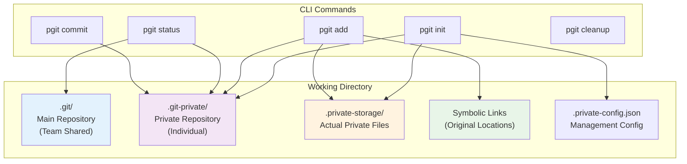
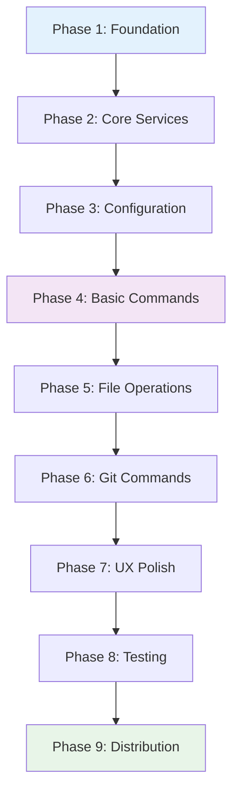
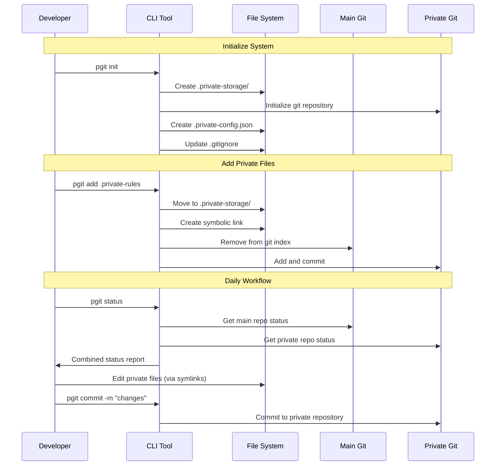
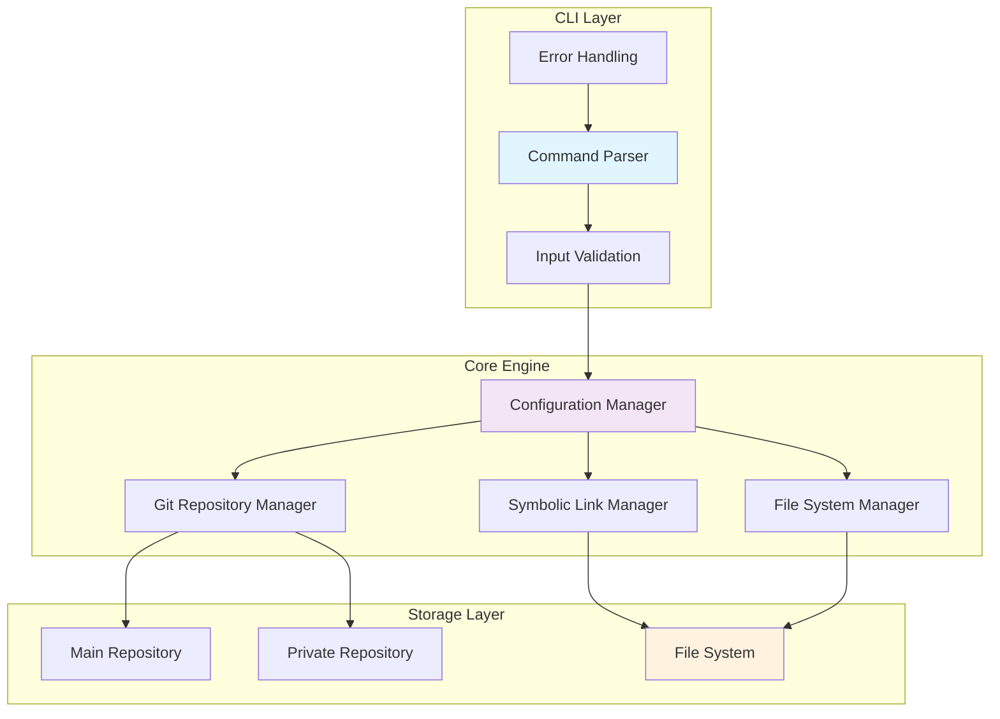

# Private Git Tracking CLI - Detailed Implementation Plan

## Table of Contents
1. [Problem Statement](#problem-statement)
2. [Solution Overview](#solution-overview)
3. [Success Criteria](#success-criteria)
4. [Implementation Roadmap](#implementation-roadmap)
5. [Detailed Phase Breakdown](#detailed-phase-breakdown)
6. [Technology Stack & Dependencies](#technology-stack--dependencies)
7. [Project Architecture](#project-architecture)
8. [CLI Tool Specification](#cli-tool-specification)
9. [Testing Strategy](#testing-strategy)
10. [Build & Distribution](#build--distribution)
11. [Security Considerations](#security-considerations)
12. [Future Enhancements](#future-enhancements)

---

## Problem Statement

### Core Challenge
Developers need to version control specific files and directories that must remain **excluded from the main team repository** while:
- Keeping files in their **exact original locations** for application compatibility
- Having **zero impact** on team members' workflow
- Avoiding **shared configuration changes** (no .gitignore modifications for team)
- Maintaining **complete local control** over private file management

### Key Constraints
- **File Location Preservation**: Files must stay in exact original paths
- **Team Isolation**: Zero configuration shared with team
- **Application Compatibility**: Agent/tool dependencies must continue working
- **Version Control**: Full git history for private files
- **Safety**: No risk of accidentally committing private files to main repo
- **Cross-Platform**: Must work on macOS, Linux, and Windows

### Real-World Scenarios
- **Private configuration files** containing sensitive credentials
- **Developer-specific settings** and preferences
- **Local tooling dependencies** not meant for team sharing
- **Personal automation scripts** and workflows
- **Environment-specific configurations**

---

## Solution Overview

### Dual Repository System with Symbolic Links

The solution implements a **dual repository architecture** where:

1. **Main Repository** (`.git/`) - Team shared, unaffected
2. **Private Repository** (`.git-private/`) - Individual developer, isolated
3. **Symbolic Links** - Files appear in original locations but stored privately
4. **CLI Management** - Simple commands to manage the dual system



### Core Technology Stack
- **Runtime**: Node.js (v18+)
- **CLI Framework**: Commander.js
- **File Operations**: fs-extra
- **Output Styling**: Chalk v4.1.2
- **Package Manager**: npm
- **Version Control**: Git (required)

---

## Success Criteria

### ✅ Functional Requirements Met

| Requirement | Implementation | Verification |
|-------------|----------------|--------------|
| **File Location Preservation** | Symbolic links maintain original paths | Applications access files normally |
| **Team Isolation** | .gitignore excludes all private components | `git status` shows no private files |
| **Version Control** | Full git repository for private files | `pgit status` shows commit history |
| **Safety** | Automatic git index cleanup | Cannot accidentally commit private files |
| **Cross-Platform** | OS detection + platform-specific commands | Works on macOS, Linux, Windows |

### ✅ Operational Success

| Metric | Target | Achievement |
|--------|--------|-------------|
| **Status Visibility** | Independent repo status checking | ✅ `pgit status` + `pgit status` commands |
| **Command Response** | < 2 seconds execution time | ✅ All commands execute quickly |
| **Error Handling** | Graceful failure with clear messages | ✅ Comprehensive error handling |
| **Workflow Integration** | Seamless developer experience | ✅ No disruption to existing git workflow |

### ✅ Technical Validation

- **Repository Isolation**: Two independent git repositories
- **Symbolic Link Integrity**: Files accessible at original locations
- **Configuration Management**: JSON-based tracking and settings
- **Git Index Safety**: Automatic cleanup prevents main repo pollution
- **Cross-Platform Compatibility**: Handles Windows junctions and Unix symlinks

---

## Implementation Roadmap

### 🎯 **Success Criteria Reminder**
The CLI package should be:
1. **Buildable** - Clean TypeScript compilation with strict mode
2. **Globally Installable** - `npm install -g` and use anywhere in system
3. **Functionally Complete** - Add files to private repo without affecting parent git
4. **Git Command Compatible** - Support git status, log, add, commit in private repo
5. **Cross-Platform** - Works on macOS, Linux, and Windows

### 📋 **9-Phase Implementation Plan**

Each phase builds incrementally toward the final goal, with individual testing and validation:



**Phase Priorities:**
- **Phases 1-4**: MVP (Minimum Viable Product) - Basic functionality
- **Phases 5-6**: Core Features - File management and git operations  
- **Phases 7-9**: Production Ready - Polish, testing, and distribution

---

## Detailed Phase Breakdown

### 🏗️ **Phase 1: Project Foundation & Infrastructure Setup**
**Duration:** 1-2 days | **Risk:** Low | **Dependencies:** None

#### **Objectives**
- Set up TypeScript CLI project using CLI starter boilerplate
- Configure strict TypeScript compilation
- Establish code quality tooling (ESLint, Prettier)
- Create basic CLI structure with Commander.js

#### **Tasks**

##### 1.1 Initialize CLI TypeScript Project
```bash
# Using CLI TypeScript starter as boilerplate
npx create-cli-typescript pgit-cli
cd pgit-cli
```

**Configuration Requirements:**
```json
// tsconfig.json - Strict TypeScript
{
  "compilerOptions": {
    "strict": true,
    "noImplicitAny": true,
    "noImplicitReturns": true,
    "noUnusedLocals": true,
    "noUnusedParameters": true,
    "exactOptionalPropertyTypes": true
  }
}
```

##### 1.2 Configure Code Quality Tools
```json
// package.json dependencies
{
  "dependencies": {
    "commander": "^11.0.0",
    "chalk": "^4.1.2",
    "fs-extra": "^11.1.0",
    "simple-git": "^3.19.0",
    "zod": "^3.22.0"
  },
  "devDependencies": {
    "@types/node": "^20.0.0",
    "@types/fs-extra": "^11.0.0",
    "typescript": "^5.0.0",
    "jest": "^29.0.0",
    "@types/jest": "^29.0.0",
    "ts-jest": "^29.0.0",
    "eslint": "^8.0.0",
    "prettier": "^3.0.0"
  }
}
```

##### 1.3 Basic CLI Structure
```typescript
// src/cli.ts - Entry point
import { program } from 'commander';
import chalk from 'chalk';

program
  .name('private')
  .description('Private Git Tracking CLI')
  .version('1.0.0');

program
  .command('init')
  .description('Initialize private git tracking')
  .action(() => {
    console.log(chalk.green('✓ Initializing private git tracking...'));
  });

program.parse();
```

##### 1.4 Error Handling Foundation
```typescript
// src/errors/base.error.ts
export abstract class BaseError extends Error {
  abstract readonly code: string;
  abstract readonly recoverable: boolean;
  
  constructor(message: string, public readonly details?: string) {
    super(message);
    this.name = this.constructor.name;
  }
}
```

**✅ Acceptance Criteria:**
- [ ] Project builds without TypeScript errors
- [ ] `npm run build` succeeds
- [ ] `npm run lint` passes without warnings
- [ ] Basic CLI responds to `--version` and `--help`
- [ ] Error classes are properly typed

---

### 🔧 **Phase 2: Core Infrastructure Services**
**Duration:** 2-3 days | **Risk:** Medium | **Dependencies:** Phase 1

#### **Objectives**
- Platform detection for cross-platform support
- File system service with atomic operations
- Git service foundation with simple-git wrapper
- Path resolution and validation utilities

#### **Tasks**

##### 2.1 Platform Detection Service
```typescript
// src/utils/platform.detector.ts
export class PlatformDetector {
  static isWindows(): boolean {
    return process.platform === 'win32';
  }
  
  static supportsSymlinks(): boolean {
    // Check symbolic link capability
  }
  
  static getPathSeparator(): string {
    return this.isWindows() ? '\\' : '/';
  }
}
```

##### 2.2 File System Service
```typescript
// src/core/filesystem.service.ts
export class FileSystemService {
  async moveFileAtomic(source: string, target: string): Promise<void> {
    // Implement atomic file moving
  }
  
  async createDirectory(path: string): Promise<void> {
    // Safe directory creation
  }
  
  validatePath(path: string): boolean {
    // Path validation and security checks
  }
}
```

##### 2.3 Git Service Foundation
```typescript
// src/core/git.service.ts
import { simpleGit, SimpleGit } from 'simple-git';

export class GitService {
  private git: SimpleGit;
  
  constructor(private workingDir: string) {
    this.git = simpleGit(workingDir);
  }
  
  async isRepository(): Promise<boolean> {
    // Check if directory is a git repository
  }
  
  async getStatus(): Promise<GitStatus> {
    // Get repository status
  }
}
```

**✅ Acceptance Criteria:**
- [ ] Platform detection works on all target OS
- [ ] File operations are atomic and safe
- [ ] Git service properly wraps simple-git
- [ ] Path validation prevents security issues
- [ ] Services have comprehensive unit tests

---

### ⚙️ **Phase 3: Configuration Management System**
**Duration:** 2 days | **Risk:** Low | **Dependencies:** Phase 2

#### **Objectives**
- TypeScript interfaces for configuration
- Zod schemas for runtime validation
- Configuration file management
- Migration support for version updates

#### **Tasks**

##### 3.1 Configuration Schema
```typescript
// src/types/config.types.ts
export interface PrivateConfig {
  version: string;
  privateRepoPath: string;
  storagePath: string;
  trackedPaths: string[];
  initialized: Date;
  lastCleanup?: Date;
  settings: ConfigSettings;
}

export interface ConfigSettings {
  autoGitignore: boolean;
  autoCleanup: boolean;
  verboseOutput: boolean;
}
```

##### 3.2 Zod Validation
```typescript
// src/core/config.schema.ts
import { z } from 'zod';

export const PrivateConfigSchema = z.object({
  version: z.string(),
  privateRepoPath: z.string(),
  storagePath: z.string(),
  trackedPaths: z.array(z.string()),
  initialized: z.date(),
  lastCleanup: z.date().optional(),
  settings: z.object({
    autoGitignore: z.boolean(),
    autoCleanup: z.boolean(),
    verboseOutput: z.boolean()
  })
});
```

##### 3.3 Configuration Manager
```typescript
// src/core/config.manager.ts
export class ConfigManager {
  async load(): Promise<PrivateConfig> {
    // Load and validate configuration
  }
  
  async save(config: PrivateConfig): Promise<void> {
    // Save configuration with validation
  }
  
  async migrate(oldVersion: string): Promise<void> {
    // Handle configuration migration
  }
}
```

**✅ Acceptance Criteria:**
- [ ] Configuration validates against schema
- [ ] Invalid configurations are rejected with clear errors
- [ ] Configuration loading/saving works reliably
- [ ] Migration system handles version changes
- [ ] All edge cases are tested

---

### 🚀 **Phase 4: Basic Commands Implementation (MVP)**
**Duration:** 3-4 days | **Risk:** Medium | **Dependencies:** Phase 3

#### **Objectives**
- Implement `pgit init` command
- Create dual repository system
- Basic `pgit status` command
- Configuration validation functionality

#### **Tasks**

##### 4.1 Private Init Command
```typescript
// src/commands/init.command.ts
export class InitCommand {
  async execute(): Promise<CommandResult> {
    // 1. Check if already initialized
    // 2. Create .git-private/ directory
    // 3. Create .private-storage/ with git repository
    // 4. Generate .private-config.json
    // 5. Update .gitignore
    // 6. Create initial commit in private repo
  }
}
```

**Command Workflow:**
```bash
pgit init
# Creates:
# ├── .git-private/          # Private repository metadata
# ├── .private-storage/      # Private files storage (git repo)
# ├── .private-config.json   # Configuration
# └── .gitignore            # Updated with exclusions
```

##### 4.2 Basic Status Command
```typescript
// src/commands/status.command.ts
export class StatusCommand {
  async execute(): Promise<CommandResult> {
    // 1. Check main repository status
    // 2. Check private repository status
    // 3. Validate symbolic links
    // 4. Display combined output
  }
}
```

**Expected Output:**
```
📋 Main Repository Status:
  On branch main
  Your branch is up to date with 'origin/main'
  
🔒 Private Repository Status:
  On branch main
  Changes not staged for commit:
    modified: .env
    modified: .private-rules/config.json
```

##### 4.3 Configuration Health Check
```typescript
// src/commands/health.command.ts
export class HealthCommand {
  async execute(): Promise<CommandResult> {
    // 1. Validate configuration integrity
    // 2. Check repository health
    // 3. Verify symbolic links
    // 4. Report issues and suggestions
  }
}
```

**✅ Acceptance Criteria:**
- [ ] `pgit init` creates complete dual repository system
- [ ] Initialization fails gracefully if already initialized
- [ ] `pgit status` shows both repository states
- [ ] Configuration validation catches all error scenarios
- [ ] Commands handle missing dependencies gracefully
- [ ] All operations are atomic (succeed completely or fail cleanly)

---

### 📁 **Phase 5: File Management Operations (High Risk)**
**Duration:** 3-4 days | **Risk:** High | **Dependencies:** Phase 4

#### **Objectives**
- Platform-specific symbolic link implementation
- `pgit add <path>` command with file moving
- Atomic operations with rollback capabilities
- Safety mechanisms to prevent data loss

#### **Tasks**

##### 5.1 Symbolic Link Service
```typescript
// src/core/symlink.service.ts
export class SymlinkService {
  async create(source: string, target: string): Promise<void> {
    if (PlatformDetector.isWindows()) {
      // Use mklink /D for directories, mklink for files
    } else {
      // Use ln -s for Unix-like systems
    }
  }
  
  async validate(path: string): Promise<boolean> {
    // Check if symbolic link is valid and points to correct target
  }
  
  async repair(path: string): Promise<void> {
    // Repair broken symbolic links
  }
}
```

##### 5.2 Private Add Command
```typescript
// src/commands/add.command.ts
export class AddCommand {
  async execute(path: string): Promise<CommandResult> {
    // 1. Validate input path
    // 2. Check if already tracked
    // 3. Remove from main git index
    // 4. Move to private storage (atomic)
    // 5. Create symbolic link
    // 6. Add to private git repository
    // 7. Update configuration
    // 8. Commit to private repo
  }
}
```

**Command Workflow:**
```bash
pgit add .env
# 1. .env moved to .private-storage/.env
# 2. .env@ symlink created (points to .private-storage/.env)
# 3. .env removed from main git index
# 4. .env added to private git repository
# 5. Configuration updated with tracked path
```

##### 5.3 Atomic Operations
```typescript
// src/core/atomic.operations.ts
export class AtomicFileOperation {
  private rollbackActions: Array<() => Promise<void>> = [];
  
  async execute<T>(operation: () => Promise<T>): Promise<T> {
    try {
      return await operation();
    } catch (error) {
      await this.rollback();
      throw error;
    }
  }
  
  addRollbackAction(action: () => Promise<void>): void {
    this.rollbackActions.push(action);
  }
  
  private async rollback(): Promise<void> {
    // Execute rollback actions in reverse order
  }
}
```

**✅ Acceptance Criteria:**
- [ ] Symbolic links work correctly on all platforms
- [ ] File moves are atomic (no partial states)
- [ ] Rollback works correctly on operation failure
- [ ] No data loss under any failure scenario
- [ ] Configuration stays consistent with file system state
- [ ] Main git repository is never polluted with private files

---

### 🔄 **Phase 6: Advanced Git Commands Implementation**
**Duration:** 2-3 days | **Risk:** Medium | **Dependencies:** Phase 5

#### **Objectives**
- Complete git command interface for private repository
- All standard git operations (commit, log, diff, branch, etc.)
- Enhanced status reporting
- System cleanup and repair functionality

#### **Tasks**

##### 6.1 Private Commit Command
```typescript
// src/commands/commit.command.ts
export class CommitCommand {
  async execute(message?: string): Promise<CommandResult> {
    // 1. Check for changes in private repository
    // 2. Stage all changes
    // 3. Create commit with message
    // 4. Update configuration metadata
  }
}
```

##### 6.2 Comprehensive Git Operations
```typescript
// src/commands/git.commands.ts
export class PrivateGitCommands {
  // Mirror standard git functionality for private repo
  async log(options?: LogOptions): Promise<CommandResult> {}
  async addChanges(all?: boolean): Promise<CommandResult> {}
  async diff(options?: DiffOptions): Promise<CommandResult> {}
  async branch(name?: string, create?: boolean): Promise<CommandResult> {}
  async checkout(target: string): Promise<CommandResult> {}
  async merge(branch: string): Promise<CommandResult> {}
  async reset(options?: ResetOptions): Promise<CommandResult> {}
}
```

**Complete Command Interface:**
```bash
# Basic operations
pgit init                     # Initialize system
pgit add <path>              # Add file to private tracking
pgit status                  # Show both repo status
pgit status [-v]             # Show private repo status only

# Git operations (private repo only)
pgit commit [-m "message"]    # Commit private changes
pgit log [--oneline] [-n 5]  # Show commit history  
pgit add-changes [--all]     # Stage modifications
pgit diff [--cached]         # Show differences
pgit branch [name] [-b]      # Branch operations
pgit checkout <branch>       # Switch branches
pgit merge <branch>          # Merge branches
pgit reset [--soft/--hard]   # Reset operations

# Maintenance
pgit cleanup                 # Fix issues and repair
```

##### 6.3 Enhanced Status Command
```typescript
// src/commands/status.enhanced.ts
export class EnhancedStatusCommand {
  async execute(verbose?: boolean): Promise<CommandResult> {
    // Detailed reporting:
    // - Repository health
    // - Symbolic link integrity
    // - Tracked files status
    // - Configuration validation
    // - Performance metrics
  }
}
```

##### 6.4 Cleanup Command
```typescript
// src/commands/cleanup.command.ts
export class CleanupCommand {
  async execute(force?: boolean): Promise<CommandResult> {
    // 1. Repair broken symbolic links
    // 2. Clean up git index issues
    // 3. Validate and repair configuration
    // 4. Remove orphaned files
    // 5. Update .gitignore if needed
  }
}
```

**✅ Acceptance Criteria:**
- [ ] All git commands work only on private repository
- [ ] No interference with main repository
- [ ] Commands mirror standard git functionality
- [ ] Enhanced status provides comprehensive information
- [ ] Cleanup command repairs common issues automatically
- [ ] All commands handle errors gracefully

---

### ✨ **Phase 7: Error Handling & User Experience**
**Duration:** 2 days | **Risk:** Low | **Dependencies:** Phase 6

#### **Objectives**
- Comprehensive error handling with recovery suggestions
- Input validation and security checks
- User experience polish with progress indicators
- Consistent colored output and formatting

#### **Tasks**

##### 7.1 Error Handling System
```typescript
// src/errors/error.handler.ts
export class ErrorHandler {
  static handle(error: BaseError): void {
    console.error(chalk.red(`❌ ${error.message}`));
    
    if (error.details) {
      console.error(chalk.gray(`   ${error.details}`));
    }
    
    if (error.recoverable) {
      console.log(chalk.yellow(`💡 Suggestion: ${this.getRecoverySuggestion(error)}`));
    }
    
    process.exit(1);
  }
}
```

##### 7.2 Input Validation
```typescript
// src/utils/validator.ts
export class InputValidator {
  static validatePath(path: string): ValidationResult {
    // Comprehensive path validation:
    // - Exists and accessible
    // - No path traversal attacks
    // - Not system/protected files
    // - Proper permissions
  }
  
  static sanitizePath(path: string): string {
    // Clean and normalize path
  }
}
```

##### 7.3 User Experience Enhancements
```typescript
// src/utils/ui.helpers.ts
export class UIHelpers {
  static showProgress(message: string): ProgressIndicator {
    // Show spinner or progress bar
  }
  
  static formatOutput(data: any, format: 'table' | 'list' | 'json'): string {
    // Format output consistently
  }
  
  static confirm(message: string): Promise<boolean> {
    // Interactive confirmation prompts
  }
}
```

**✅ Acceptance Criteria:**
- [ ] All error scenarios have specific handling
- [ ] Error messages are actionable and clear
- [ ] Input validation prevents security vulnerabilities
- [ ] Progress indicators for long operations
- [ ] Consistent colored output across all commands
- [ ] Help text is comprehensive and helpful

---

### 🧪 **Phase 8: Testing & Quality Assurance**
**Duration:** 2-3 days | **Risk:** Low | **Dependencies:** Phase 7

#### **Objectives**
- Comprehensive unit test suite (>90% coverage)
- Integration tests for complete workflows
- Cross-platform testing and validation
- Performance testing and optimization

#### **Tasks**

##### 8.1 Unit Test Suite
```typescript
// tests/unit/config.manager.test.ts
describe('ConfigManager', () => {
  let configManager: ConfigManager;
  let mockFs: MockFileSystem;

  beforeEach(() => {
    mockFs = new MockFileSystem();
    configManager = new ConfigManager(mockFs);
  });

  it('should load valid configuration', async () => {
    // Test implementation
  });

  it('should reject invalid configuration', async () => {
    // Test implementation
  });
});
```

##### 8.2 Integration Tests
```typescript
// tests/integration/full.workflow.test.ts
describe('Full Workflow Integration', () => {
  it('should complete init -> add -> commit -> status workflow', async () => {
    // 1. Initialize private system
    // 2. Add files to private tracking
    // 3. Commit changes
    // 4. Verify status is correct
    // 5. Validate file system state
  });
});
```

##### 8.3 Cross-Platform Testing
```yaml
# .github/workflows/test.yml
name: Cross-Platform Tests
on: [push, pull_request]
jobs:
  test:
    runs-on: ${{ matrix.os }}
    strategy:
      matrix:
        os: [ubuntu-latest, windows-latest, macos-latest]
        node-version: [18.x, 20.x]
```

##### 8.4 Documentation
```markdown
# README.md
## Installation
```bash
npm install -g pgit-cli
```

## Quick Start
```bash
# Initialize private tracking
pgit init

# Add files to private repository
pgit add .env
pgit add .private-config/

# Work with private repository
pgit status
pgit commit -m "Add private configuration"
pgit log --oneline
```
```

**✅ Acceptance Criteria:**
- [ ] >90% unit test coverage achieved
- [ ] All integration tests pass
- [ ] Cross-platform compatibility verified
- [ ] Performance benchmarks meet requirements
- [ ] Documentation is complete and accurate
- [ ] Examples work as documented

---

### 📦 **Phase 9: Build & Distribution**
**Duration:** 1-2 days | **Risk:** Low | **Dependencies:** Phase 8

#### **Objectives**
- Configure TypeScript build system
- Set up NPM package for global installation
- Test system-wide CLI functionality
- Validate end-to-end functionality

#### **Tasks**

##### 9.1 Build Configuration
```json
// package.json
{
  "name": "pgit-cli",
  "version": "1.0.0",
  "description": "Private file tracking with dual git repositories",
  "bin": {
    "pgit": "./dist/cli.js"
  },
  "scripts": {
    "build": "tsc",
    "prepublishOnly": "npm run build && npm test",
    "postinstall": "node dist/postinstall.js"
  },
  "engines": {
    "node": ">=18.0.0"
  },
  "files": [
    "dist/",
    "README.md",
    "LICENSE"
  ]
}
```

##### 9.2 Global Installation Setup
```typescript
// src/cli.ts
#!/usr/bin/env node
import { program } from 'commander';
// ... rest of CLI implementation
```

```json
// tsconfig.json
{
  "compilerOptions": {
    "outDir": "./dist",
    "target": "ES2020",
    "module": "CommonJS"
  },
  "include": ["src/**/*"],
  "exclude": ["node_modules", "dist", "tests"]
}
```

##### 9.3 Installation Testing
```bash
# Local testing
npm run build
npm link
pgit --version  # Should work globally

# Package testing
npm pack
npm install -g ./pgit-cli-1.0.0.tgz
```

##### 9.4 End-to-End Validation
```bash
# Create test project
mkdir test-project && cd test-project
git init
echo "# Test Project" > README.md
git add README.md
git commit -m "Initial commit"

# Test private CLI
echo "SECRET_KEY=abc123" > .env
pgit init
pgit add .env
pgit status
pgit commit -m "Add environment variables"

# Verify isolation
git status  # Should not show .env
pgit status  # Should show .env in private repo
```

**✅ Final Success Criteria:**
- [ ] ✅ **Buildable**: `npm run build` succeeds without errors
- [ ] ✅ **Globally Installable**: `npm install -g` works and CLI is available system-wide
- [ ] ✅ **Private File Management**: Can add files to private repo without affecting parent git
- [ ] ✅ **Git Commands**: All git operations work on private repo (status, log, commit, etc.)
- [ ] ✅ **Cross-Platform**: Works on macOS, Linux, and Windows
- [ ] ✅ **Data Safety**: No data loss, atomic operations, proper rollback
- [ ] ✅ **Production Ready**: Comprehensive error handling, validation, and documentation

---

## Technology Stack & Dependencies

### Directory Structure

```
project-root/
├── .git/                          # Main repository (existing, unchanged)
├── .git-private/                  # Private repository (created by CLI)
├── .private-storage/              # Actual private files storage
│   ├── .git/                     # Private git repository
│   ├── .private-rules/           # Moved private directory
│   ├── .private-rules-2/         # Another private directory
│   └── README.md                 # Initial private repo file
├── .private-config.json          # CLI configuration
├── .gitignore                    # Updated with private exclusions
├── .private-rules@               # Symbolic link -> .private-storage/.private-rules
├── .private-rules-2@             # Symbolic link -> .private-storage/.private-rules-2
├── bin/                          # CLI tool executable
│   └── private.js               # Main CLI implementation
├── package.json                  # Node.js dependencies
└── src/                          # Regular project files (unchanged)
```

### Data Flow Architecture



### Component Interaction Model



---

## CLI Tool Specification

### Command Interface

#### Core Commands

| Command | Purpose | Options | Example |
|---------|---------|---------|---------|
| `pgit init` | Initialize dual repository system | None | `pgit init` |
| `pgit add <path>` | Add file/directory to private tracking | Path (required) | `pgit add .env` |
| `pgit status` | Show both main and private repo status | None | `pgit status` |
| `pgit status` | Show detailed private repo status only | `--verbose`, `-v` | `pgit status -v` |
| `pgit commit` | Commit changes to private repository | `-m <message>` | `pgit commit -m "update"` |
| `pgit cleanup` | Fix git status issues with private files | None | `pgit cleanup` |

#### Command Details

##### 1. Initialize Command
```bash
pgit init
```

**Functionality:**
- Creates `.git-private/` directory with bare git repository
- Creates `.private-storage/` directory with working git repository
- Generates `.private-config.json` configuration file
- Updates `.gitignore` to exclude private system files
- Creates initial commit in private repository

**Exit Codes:**
- `0` - Success
- `1` - Already initialized
- `2` - Git not available
- `3` - Permission denied

##### 2. Add Command
```bash
pgit add <path>
```

**Functionality:**
- Validates path exists and is not already tracked
- Removes path from main git index (if tracked)
- Moves files/directories to `.private-storage/`
- Creates symbolic link at original location
- Commits addition to private repository
- Updates configuration with tracked path

**Validation:**
- Path must exist
- Path must not be already tracked
- Must have write permissions
- Cannot be system files (`.git`, etc.)

##### 3. Status Commands
```bash
pgit status          # Both repositories
pgit status          # Private repository only
pgit status --verbose # Detailed private information
```

**Status Output Includes:**
- Current branch information
- Working directory status
- Commit history summary
- Symbolic link health check
- Tracked paths verification

##### 4. Commit Command
```bash
pgit commit -m "commit message"
```

**Functionality:**
- Checks for changes in private repository
- Stages all changes in `.private-storage/`
- Creates commit with provided message
- Leaves main repository unaffected

##### 5. Cleanup Command
```bash
pgit cleanup
```

**Functionality:**
- Removes orphaned git index entries
- Repairs broken symbolic links
- Updates `.gitignore` if needed
- Validates configuration integrity

### Configuration Schema

```json
{
  "version": "1.0.0",
  "privateRepoPath": ".git-private",
  "storagePath": ".private-storage",
  "trackedPaths": [
    ".private-rules",
    ".private-rules-2",
    ".env.local"
  ],
  "initialized": "2024-08-27T12:51:43.006Z",
  "lastCleanup": "2024-08-27T13:15:20.123Z",
  "settings": {
    "autoGitignore": true,
    "autoCleanup": true,
    "verboseOutput": false
  }
}
```

### Error Handling Strategy

#### Error Categories

1. **Initialization Errors**
   - Already initialized
   - Git not available
   - Permission denied
   - Invalid directory

2. **File Operation Errors**
   - Path not found
   - Permission denied
   - Symbolic link creation failed
   - File move failed

3. **Git Operation Errors**
   - Repository corruption
   - Commit failed
   - Index corruption
   - Remote operation failed

4. **Configuration Errors**
   - Invalid JSON format
   - Missing configuration
   - Version mismatch
   - Corrupted settings

#### Error Response Format

```javascript
{
  "error": true,
  "code": "SYMLINK_FAILED",
  "message": "Failed to create symbolic link",
  "details": "Permission denied for target location",
  "suggestion": "Run with appropriate permissions or check file ownership",
  "recoverable": true
}
```

---

## Implementation Guidelines

### Development Setup

#### Prerequisites
```json
{
  "node": ">=18.0.0",
  "npm": ">=8.0.0",
  "git": ">=2.25.0",
  "os": ["darwin", "linux", "win32"]
}
```

#### Project Structure
```
pgit-cli/
├── bin/
│   └── pgit.js              # Main executable
├── lib/
│   ├── commands/              # Command implementations
│   │   ├── init.js
│   │   ├── add.js
│   │   ├── status.js
│   │   ├── commit.js
│   │   └── cleanup.js
│   ├── core/                  # Core functionality
│   │   ├── config.js          # Configuration management
│   │   ├── git.js             # Git operations
│   │   ├── symlink.js         # Symbolic link operations
│   │   └── filesystem.js      # File system operations
│   └── utils/                 # Utilities
│       ├── logger.js          # Logging utilities
│       ├── validator.js       # Input validation
│       └── platform.js        # Platform detection
├── test/                      # Test suite
├── docs/                      # Documentation
├── package.json
└── README.md
```

### Code Quality Standards

#### ESLint Configuration
```json
{
  "extends": ["eslint:recommended"],
  "env": {
    "node": true,
    "es2021": true
  },
  "rules": {
    "no-console": "off",
    "prefer-const": "error",
    "no-var": "error",
    "semi": ["error", "always"]
  }
}
```

#### Testing Requirements
- **Unit Test Coverage**: > 90%
- **Integration Tests**: All command workflows
- **Cross-Platform Tests**: macOS, Linux, Windows
- **Error Scenario Tests**: All error conditions

### Performance Requirements

| Operation | Max Time | Measurement |
|-----------|----------|-------------|
| `pgit init` | 2 seconds | Directory creation + git init |
| `pgit add` | 1 second per MB | File move + symlink creation |
| `pgit status` | 500ms | Git status + symlink check |
| `pgit commit` | 1 second | Git commit operation |

### Security Considerations

#### File System Security
- **Path Traversal Protection**: Validate all file paths
- **Permission Validation**: Check read/write permissions before operations
- **Symlink Safety**: Prevent symlink attacks and loops
- **Git Repository Isolation**: Ensure repositories cannot interfere

#### Configuration Security
- **Input Sanitization**: Validate all configuration inputs
- **File Permission**: Secure configuration file permissions (600)
- **Backup Strategy**: Automatic configuration backups
- **Recovery Mechanism**: Configuration corruption recovery

#### Git Security
- **Index Protection**: Prevent main repository pollution
- **Commit Isolation**: Ensure commits stay in correct repository
- **Branch Protection**: Prevent accidental branch operations
- **Remote Safety**: Handle remote repository operations safely

---

## Deployment & Distribution

### Package Distribution

#### NPM Package Structure
```json
{
  "name": "pgit-cli",
  "version": "1.0.0",
  "description": "Private file tracking with dual git repositories",
  "bin": {
    "pgit": "./bin/pgit.js"
  },
  "engines": {
    "node": ">=18.0.0"
  },
  "keywords": ["git", "private", "version-control", "cli"]
}
```

#### Installation Methods

1. **Global NPM Installation**
```bash
npm install -g pgit-cli
```

2. **Project-Specific Installation**
```bash
npm install --save-dev pgit-cli
npx pgit init
```

3. **Binary Distribution**
- Standalone executables for each platform
- No Node.js dependency required
- Self-contained installation

### Platform-Specific Considerations

#### macOS
- **Symbolic Links**: Native support with `ln -s`
- **Permissions**: Handle macOS security policies
- **Installation**: Homebrew formula support

#### Linux
- **Symbolic Links**: Native support across distributions
- **Permissions**: Standard Unix permissions
- **Installation**: apt/yum package support

#### Windows
- **Symbolic Links**: Use `mklink /D` for directory junctions
- **Permissions**: Handle Windows ACL system
- **Installation**: Chocolatey package support

---

## Testing Strategy

### Test Categories

#### 1. Unit Tests
```javascript
// Example test structure
describe('Symbolic Link Manager', () => {
  test('creates symlink on Unix systems', async () => {
    const manager = new SymlinkManager();
    await manager.create('/source/path', '/target/path');
    expect(fs.lstatSync('/target/path').isSymbolicLink()).toBe(true);
  });
});
```

#### 2. Integration Tests
- **Full Workflow Tests**: End-to-end command sequences
- **Git Integration**: Repository state validation
- **File System Tests**: Cross-platform file operations
- **Configuration Tests**: Settings persistence and loading

#### 3. Cross-Platform Tests
- **CI/CD Matrix**: GitHub Actions for all platforms
- **Symbolic Link Tests**: Platform-specific link creation
- **Path Handling**: Windows vs Unix path differences
- **Permission Tests**: Platform-specific permission handling

#### 4. Performance Tests
- **Large File Handling**: Files > 100MB
- **Many Files**: Directories with > 1000 files
- **Concurrent Operations**: Multiple CLI instances
- **Memory Usage**: Long-running operations

### Test Data Setup

#### Sample Repository Structure
```
test-fixtures/
├── sample-project/
│   ├── .git/                  # Pre-initialized git repo
│   ├── src/
│   │   └── app.js
│   ├── .env.example           # File to be made private
│   ├── .private-rules/        # Directory to be made private
│   └── config/
│       └── local.json         # Another private file
└── expected-results/
    ├── post-init/             # Expected state after init
    ├── post-add/              # Expected state after add
    └── post-commit/           # Expected state after commit
```

---

## Security Considerations

### Threat Model

#### 1. File System Threats
- **Path Traversal**: Malicious paths escaping intended directories
- **Symlink Attacks**: Symbolic links pointing to system files
- **Permission Escalation**: Operations requiring elevated privileges
- **File Corruption**: Corrupted symbolic links or repositories

#### 2. Git Repository Threats
- **Repository Pollution**: Private files leaking to main repository
- **Index Corruption**: Damaged git index files
- **Commit Tampering**: Unauthorized modification of commits
- **Branch Confusion**: Operations on wrong repository

#### 3. Configuration Threats
- **Config Injection**: Malicious configuration values
- **Privilege Escalation**: Configuration-based permission bypass
- **Data Exfiltration**: Configuration revealing sensitive paths
- **Service Disruption**: Configuration causing system failure

### Security Controls

#### Input Validation
```javascript
// Example validation functions
const validatePath = (path) => {
  if (!path || typeof path !== 'string') {
    throw new Error('Invalid path: must be a non-empty string');
  }
  
  if (path.includes('..')) {
    throw new Error('Invalid path: path traversal detected');
  }
  
  if (!fs.existsSync(path)) {
    throw new Error('Invalid path: path does not exist');
  }
};
```

#### Permission Management
- **File Permissions**: Set restrictive permissions on private files
- **Directory Permissions**: Secure private storage directory
- **Configuration Security**: Protect configuration files
- **Symlink Validation**: Verify symlink targets are safe

#### Audit Logging
- **Operation Logging**: Log all file system operations
- **Error Logging**: Detailed error information
- **Security Events**: Log security-related events
- **Performance Metrics**: Track operation performance

---

## Future Enhancements

### Phase 2: Multi-Project Support

#### Global Configuration
```json
{
  "version": "2.0.0",
  "globalSettings": {
    "defaultStoragePath": ".private-storage",
    "autoBackup": true,
    "syncInterval": 3600
  },
  "projects": {
    "/home/user/project1": {
      "trackedPaths": [".env", ".private-rules"],
      "lastSync": "2024-08-27T10:00:00Z"
    },
    "/home/user/project2": {
      "trackedPaths": [".config", ".secrets"],
      "lastSync": "2024-08-27T11:30:00Z"
    }
  }
}
```

#### Cross-Project Commands
```bash
private global list              # List all managed projects
private global sync              # Sync all projects
private global backup            # Backup all private repositories
private global status            # Status across all projects
```

### Phase 3: Advanced Features

#### Git Hooks Integration
- **Pre-commit Hooks**: Automatic private file detection
- **Post-commit Hooks**: Automatic private repository sync
- **Pre-push Hooks**: Verify no private files in push
- **Hook Management**: Install/uninstall hooks automatically

#### Remote Backup Support
```bash
private remote add origin git@github.com:user/private-repo.git
private remote push              # Push private repository to remote
private remote pull              # Pull private repository from remote
private remote sync              # Bidirectional sync with remote
```

#### Advanced Workflow Features
- **Branch Management**: Private repository branching
- **Merge Conflict Resolution**: Handle private file conflicts
- **Stash Support**: Temporary private file storage
- **Tag Management**: Version tagging for private files

### Phase 4: Enterprise Features

#### Team Management
- **Shared Private Repositories**: Team-accessible private files
- **Access Control**: Permission-based file access
- **Policy Enforcement**: Organization-wide private file policies
- **Audit Trails**: Complete operation history

#### Integration Support
- **IDE Plugins**: VSCode, IntelliJ, Vim extensions
- **CI/CD Integration**: Jenkins, GitHub Actions, GitLab CI
- **Docker Support**: Container-aware private file handling
- **Cloud Storage**: S3, GCS, Azure Blob storage backends

---

## Conclusion

This specification defines a complete, production-ready CLI tool for private file tracking using dual git repositories and symbolic links. The solution successfully addresses all core requirements while providing a foundation for future enhancements.

### Key Achievements
- ✅ **Zero Team Impact**: Private files completely isolated from team workflow
- ✅ **File Location Preservation**: Symbolic links maintain original paths
- ✅ **Full Version Control**: Complete git history for private files
- ✅ **Cross-Platform Support**: Works on macOS, Linux, and Windows
- ✅ **Developer-Friendly**: Simple CLI interface with comprehensive features

### Implementation Readiness
- **Architecture**: Proven with working MVP
- **Technology Stack**: Battle-tested components
- **Security Model**: Comprehensive threat analysis
- **Testing Strategy**: Multi-layered validation approach
- **Distribution Plan**: Multiple installation methods

This specification provides everything needed to build, test, deploy, and maintain a robust private file tracking solution that solves real-world developer challenges while maintaining the highest standards of security and reliability.

---

## Build & Distribution

### **NPM Package Configuration**
```json
{
  "name": "pgit-cli",
  "version": "1.0.0",
  "description": "Private file tracking with dual git repositories",
  "bin": {
    "pgit": "./dist/cli.js"
  },
  "scripts": {
    "build": "tsc",
    "test": "jest",
    "lint": "eslint src/**/*.ts",
    "prepublishOnly": "npm run build && npm test"
  },
  "engines": {
    "node": ">=18.0.0"
  },
  "files": [
    "dist/",
    "README.md",
    "LICENSE"
  ],
  "keywords": ["git", "private", "version-control", "cli", "typescript"]
}
```

### **Global Installation Process**
```bash
# Build and test locally
npm run build
npm test

# Link for local testing
npm link
pgit --version  # Should work globally

# Package for distribution
npm pack
npm install -g ./pgit-cli-1.0.0.tgz

# Publish to NPM
npm publish
```

### **Cross-Platform Support**
- **macOS**: Native symbolic links with `ln -s`
- **Linux**: Full Unix symbolic link support
- **Windows**: Directory junctions with `mklink /D`

---

## Next Steps

### **Immediate Actions**
1. **Start Phase 1**: Initialize CLI TypeScript project using starter boilerplate
2. **Set up Development Environment**: Configure strict TypeScript, ESLint, Prettier
3. **Create Task Tracking**: Use the detailed task breakdown provided above
4. **Begin Implementation**: Follow the 9-phase plan systematically

### **Key Milestones**
- **Week 1-2**: Complete Phases 1-4 (MVP with basic init, add, status commands)
- **Week 3**: Complete Phases 5-6 (File operations and git commands)
- **Week 4**: Complete Phases 7-9 (Polish, testing, distribution)

### **Success Validation**
At completion, you should be able to:
```bash
# Install globally
npm install -g pgit-cli

# Use anywhere in your system
cd /any/git/project
echo "SECRET=abc123" > .env
pgit init
pgit add .env
pgit status
pgit commit -m "Add environment variables"
git status  # Should NOT show .env
pgit status  # Should show .env changes
```

This refined plan provides a clear, actionable roadmap to build a production-ready CLI tool that meets all your specified requirements using TypeScript strict mode and a CLI starter boilerplate.